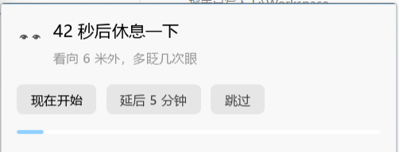
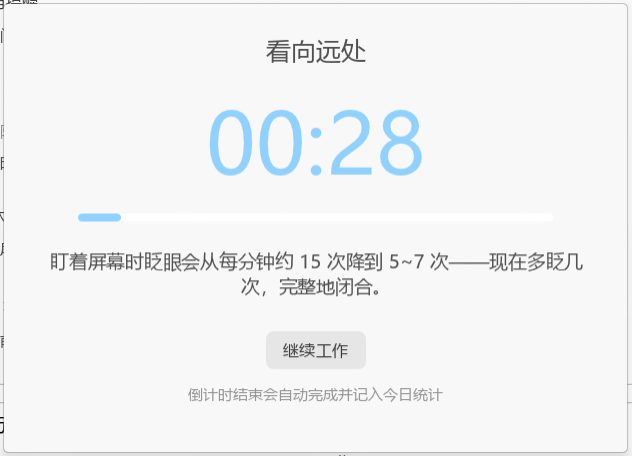
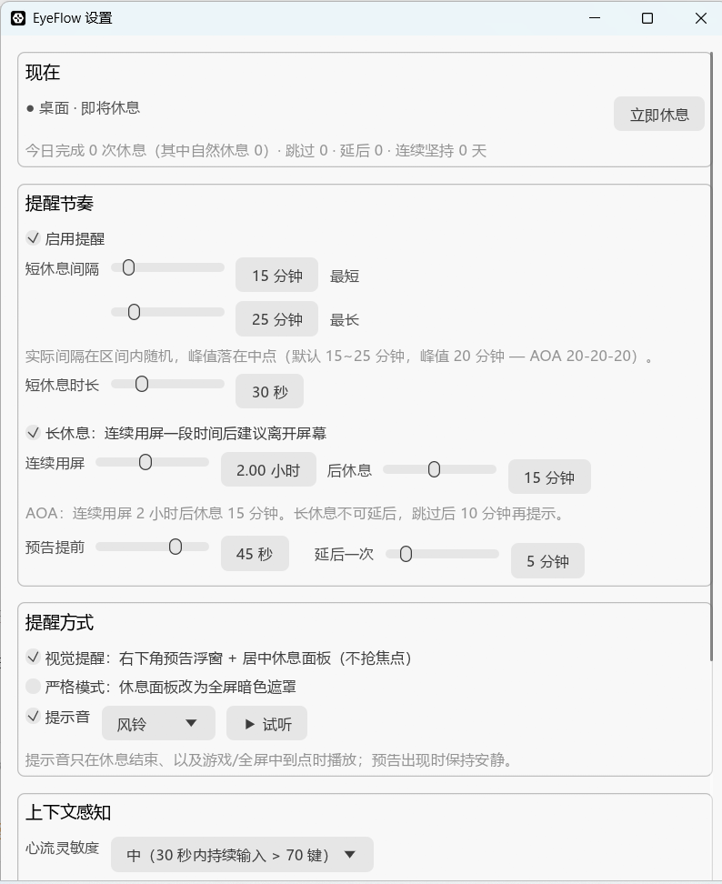
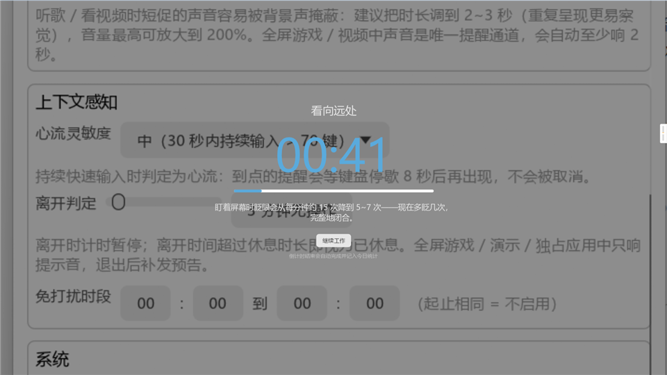

# EyeFlow

**Context-aware eye-care break reminder for Windows · 会看情况的 Windows 护眼提醒**

EyeFlow 是一款"会看情况的护眼提醒"工具:它知道你正打字进入心流、在全屏游戏、还是已经离开座位——到点的提醒只会**顺延**到更合适的时机、换一种更轻的形态,而**不会消失**。

- 免费开源(MIT) · Rust 单进程 · 无 Electron / WebView
- 便携 exe 约 10 MB;空闲常驻约 16 MB(未打开窗口时),窗口显示期间因 GPU 上下文短暂升至约 200 MB,关闭后回落到 60~90 MB(显卡驱动残留,实测见 [ADR-0006](docs/adr/0006-eframe-on-demand-ui-session.md))

[](https://github.com/lexingtonhibiki/EyeFlow/actions/workflows/ci.yml)
[](https://github.com/lexingtonhibiki/EyeFlow/releases)
[](LICENSE)
[](#下载安装)

> 说明:本文仓库地址均写作 `https://github.com/lexingtonhibiki/EyeFlow`,以实际创建的仓库为准。

## 界面预览

| 图标 | 预告浮窗(右下角,不抢焦点) | 休息界面(居中) |
|:---:|:---:|:---:|
|  |  |  |

<details>
<summary>设置窗口 / 严格模式自选壁纸</summary>



严格模式 + 自选背景图片(铺满裁剪 + 暗色蒙层),倒计时与贴士叠在图上:



</details>

## 为什么是 EyeFlow

市面上不缺护眼提醒,缺的是"时机选得对"的护眼提醒。竞品调研([docs/research/03-competitor-ux.md](docs/research/03-competitor-ux.md))的结论是:**"用户留下来靠预告 + 可控的强制 + 可见的坚持记录;用户卸载靠时机不对的打断。"**

- **Stretchly**(免费开源,Electron):Windows 上全屏检测六年未解决([issue #355](https://github.com/hovancik/stretchly/issues/355),全屏应用中直接失灵),内存与能耗偏高,且没有坚持统计;
- **Workrave**(免费开源):默认 3 分钟一次过于频繁,无全屏/上下文感知,强制阻挡键鼠让部分用户不适;
- **LookAway**(商业):上下文感知做得最好,但 macOS 专属($19 买断),Windows 版长期"coming soon"。

**Windows + 免费 + 全屏/心流智能静默 + Rust 轻量——这个组合在免费市场目前是空白,EyeFlow 正好落在这里。**

| | EyeFlow | Stretchly | Workrave | LookAway |
|---|---|---|---|---|
| 平台 | Windows 10/11 x64 | Win/Mac/Linux(Electron) | Win/Linux | 仅 macOS |
| 价格 | 免费开源(MIT) | 免费开源 | 免费开源 | $19/$29 买断 |
| 全屏/游戏处理 | 自动降级:仅提示音,退出后补发预告 | 需手写 JSON 进程排除 | 无 | 有(macOS) |
| 心流处理 | 顺延到停歇 8 秒后投递 | 无 | 无 | 深度专注检测(macOS) |
| 坚持统计 | 有(本地 stats.toml) | 无 | 有 | 有 |
| 体积 | 单文件约 10 MB(Rust) | 约 100 MB 级(Electron) | 数 MB | 原生 |

## 功能特性

- **上下文感知**:桌面 / 心流 / 游戏 / 离开 四态自动切换,提醒只在合适的时机、以合适的形态出现
- **提醒只顺延、不消失**:心流中顺延到输入停歇 8 秒后完整投递;游戏中只响提示音,退出全屏后补发预告([ADR-0002](docs/adr/0002-reminders-are-deferred-never-dropped.md))
- **双层休息**:短休息(15~25 分钟三角随机、峰值 20 分钟、持续 30 秒)+ 长休息(连续用屏 2 小时 → 15 分钟)([ADR-0001](docs/adr/0001-aoa-20-20-20-two-tier-breaks.md))
- **完整提醒链路**:预告浮窗(不抢焦点)→ 休息界面(倒计时 + 一条权威护眼贴士)→ 自动计入坚持统计
- **用户始终可控**:延后 5 分钟(每次提醒限 1 次,长休息同样可延后)、跳过、立即开始、暂停 1 小时、免打扰时段;今日延后次数在设置窗按 0 / 1~2 / ≥3 次灰 / 橙 / 红着色
- **严格模式**(可选,默认关):休息界面变为全屏遮罩,可自选背景图片,三种自适应方式 + 实时裁剪预览
- **5 种合成提示音 + 自定义音频**:gentle_chime / soft_tap / water_drop / digital_drop / triple_beep,或自选 wav / mp3 / ogg / flac / m4a 文件(≤ 5 分钟);音量 50%~200%、时长 1~5 秒可调(听歌 / 看视频时建议 2~3 秒);无音频设备自动降级为静音
- **坚持统计**:今日完成(短/长/自然)、跳过、延后次数、连续坚持天数
- **托盘 + 热键**:左键单击/双击打开设置;Ctrl+Shift+E 立即休息;tooltip 显示当前状态与下次休息时间
- **轻量**:Rust 单进程,无 Electron / WebView;exe 约 10 MB;平时没有任何窗口和 GPU 上下文,空闲常驻约 16 MB,只在显示浮窗 / 设置时才短暂启动 UI 会话([ADR-0006](docs/adr/0006-eframe-on-demand-ui-session.md))
- **隐私友好**:纯本地运行,无网络、无遥测、无账号
- **单实例**:重复启动直接退出

## 科学依据

默认参数不是拍脑袋,而是取自机构指南与同行评审研究(完整调研见 [docs/research/02-science-evidence.md](docs/research/02-science-evidence.md)):

- **20-20-20**:每 20 分钟看 6 米(20 英尺)外 20 秒——出自美国验光协会(AOA)的[计算机视综合征指南](https://www.aoa.org/healthy-eyes/eye-and-vision-conditions/computer-vision-syndrome)。它也是唯一同时有机构指南背书与随机对照试验直接检验的节奏([Talens-Estarelles et al. 2023](https://pubmed.ncbi.nlm.nih.gov/35963776/):执行 2 周后数字视疲劳与干眼症状显著改善)。
- **2 小时 / 15 分钟**:AOA 同一指南要求连续用屏 2 小时后休息眼睛 15 分钟——EyeFlow 的长休息由此而来。
- **短休息默认 30 秒而非 20 秒**:自发微休息的平均时长是 27.4 秒,且操作者常在完全恢复前提前结束([Henning et al. 1989](https://pubmed.ncbi.nlm.nih.gov/2806221/));30 秒更接近自然恢复量。休息贴士会同时提醒"看 6 米外"与"多眨几次眼"——盯着屏幕时眨眼会从每分钟约 15 次降到 5~7 次([AAO](https://www.aao.org/eye-health/tips-prevention/computer-usage))。
- **不做蓝光滤镜**:[Cochrane 2023](https://www.cochranelibrary.com/cdsr/doi/10.1002/14651858.CD013244.pub2/full) 对 17 项 RCT 的综述显示蓝光过滤对视疲劳可能没有短期获益,AAO 也明确"无证据表明屏幕蓝光损伤眼睛";且与 Windows 自带"夜间模式"重叠。因此明确不做([ADR-0003](docs/adr/0003-gentle-by-default-no-bluelight-no-lockdown.md))。
- **不做"防近视 / 防眼损伤"承诺**:AAO 将数字视疲劳定位为暂时性、可逆的不适,护眼贴士与文案刻意避开此类表述。

## 下载安装

系统要求:Windows 10 / 11,x64。前往 [Releases](https://github.com/lexingtonhibiki/EyeFlow/releases) 页面:

### 安装版

1. 下载 `EyeFlow-<版本>-Setup.exe` 并运行;安装选项页可勾选是否创建桌面快捷方式;
2. 安装完成时可选"立即启动";安装默认写入开机自启(可在设置界面关闭);首次运行会自动打开设置窗;
3. 卸载:系统"设置 → 应用 → 安装的应用",或开始菜单中的 Uninstall EyeFlow(无残留:程序、配置、统计、日志、快捷方式、注册表项全部清理)。

> **关于 SmartScreen**:安装包与 exe 目前未做代码签名,首次运行时 Windows SmartScreen 可能提示"Windows 已保护你的电脑"。请点击 **更多信息 → 仍要运行**。

### 便携版

下载 `eyeflow-<版本>-x86_64-portable.zip`,解压即用,不写注册表;便携运行默认**不**写开机自启。

### winget(计划中)

计划向 winget-pkgs 提交清单,届时可直接 `winget install eyeflow`(见 [Roadmap](#roadmap))。

## 使用说明

### 托盘

- **左键单击 / 双击**图标:打开设置;
- **右键菜单**:打开设置 · 启用提醒(勾选) · 立即休息 · 暂停 1 小时 · 静音 · 退出;
- **悬停 tooltip**:当前状态与下次休息时间。

注意:**暂停**(整个提醒功能停止一段时间)与**静音**(只关闭提示音,视觉提醒照常)是两件事。

### 全局热键

- `Ctrl+Shift+E`:立即休息。组合键是操作系统级**全局独占**资源,可能与其他软件冲突,可在设置 → 系统 中随时关闭;关闭后托盘菜单的“立即休息”不受影响。

### 一次提醒的完整链路

1. **预告浮窗**(屏幕右下角,置顶但不抢焦点):"N 秒后休息一下",可选 **现在开始** / **延后 5 分钟**(每次提醒限 1 次)/ **跳过**;
2. **休息界面**(屏幕居中,置顶不抢焦点):大倒计时 + 一条来自 AOA/AAO 的护眼贴士;点击 **[继续工作]** 记为跳过;倒计时走完自动**完成**并播结束音;
3. **结算**:本次结果计入坚持统计(今日完成 / 跳过 / 延后 / 连续坚持天数)。

补充规则:长休息可延后一次,到点后仍是长休息;跳过长休息后 10 分钟会再次提示;严格模式(默认关)下休息界面变为全屏遮罩,可在设置里选一张背景图片并预览裁剪效果。

### 上下文行为

| 上下文 | 如何判定 | 到点行为 |
|---|---|---|
| 桌面 | 默认状态(非全屏、键盘活动低) | 完整投递:预告 → 休息界面 |
| 心流 | 30 秒滑窗按键数达阈值(低 40 / 中 70 / 高 100,已过滤按键自动重复) | **顺延**:等输入停歇 8 秒后完整投递 |
| 游戏 / 不可打扰 | SHQueryUserNotificationState(独占全屏 / 演示 / 锁屏等)+ 前台全屏窗口比对兜底 | **立即仅响提示音**;退出后补发预告 |
| 离开 | 无鼠标键盘输入 ≥ 3 分钟(away_secs) | 计时**暂停**;进入离开状态即视为一次自然休息,回来后重新计时;离开 ≥ 15 分钟清零长休息的用屏累计 |

原则:**上下文只能改变提醒的投递时机与形态,不能取消提醒**(顺延 ≠ 延后:顺延是系统自动推后,延后是你主动推迟)。

### 免打扰时段

默认 00:00–08:00 不提醒;时段结束后若提醒已到点,将在 60 秒后投递。"暂停 1 小时"同理。

## 配置文件

配置位于 `%APPDATA%\eyeflow\config.toml`,推荐通过设置界面修改;手工编辑同样有效。解析失败时原文件会备份为 `config.toml.bak-corrupt-<时间戳>` 后以默认值重建;检测到 v0.1 旧格式(`min_interval_secs` 等字段)时会自动迁移——你改过的间隔与免打扰时段带过来,旧默认值换成新的循证默认值,原文件备份为 `config.toml.bak-v0.1-<时间戳>`。

```toml
enabled = true                 # 提醒总开关(与托盘"启用提醒"一致)
short_break_min_secs = 900     # 短休息间隔下限(15 分钟)
short_break_max_secs = 1500    # 短休息间隔上限(25 分钟;三角分布,峰值 20 分钟)
short_break_secs = 30          # 短休息时长(秒)
long_break_enabled = true      # 是否启用长休息
long_break_after_secs = 7200   # 连续用屏多久触发长休息(2 小时)
long_break_secs = 900          # 长休息时长(15 分钟)
heads_up_secs = 15             # 预告提前量(秒;长休息预告为 30 秒)
postpone_secs = 300            # 延后时长(5 分钟;每次提醒最多延后 1 次)
sound_enabled = true           # 提示音开关
sound_preset = "gentle_chime"  # 提示音预设:gentle_chime / soft_tap / water_drop / digital_drop / triple_beep / custom
custom_sound_path = ""         # sound_preset = "custom" 时使用的音频文件(wav / mp3 / ogg / flac / m4a / aac,≤ 5 分钟)
cue_volume_pct = 100           # 提示音音量 50~200%(>100 为主动放大,适配音乐/视频场景)
cue_duration_secs = 1          # 提示音时长 1~5 秒(短图案循环铺满;全屏时声音是唯一通道,自动至少 2 秒)
hotkey_enabled = true          # 全局热键 Ctrl+Shift+E(立即休息);会全局独占组合键,可关闭
visual_enabled = true          # 视觉提醒(预告浮窗 + 休息界面);关闭后仅声音
strict_mode = false            # 严格模式:休息界面变为全屏遮罩
strict_wallpaper_path = ""     # 严格模式背景图片(png / jpg / webp / bmp / gif),留空为纯暗色
strict_wallpaper_fit = "cover" # 背景自适应:cover(铺满裁剪)/ contain(完整显示)/ stretch(拉伸)
strict_overlay_pct = 55        # 严格模式蒙层浓度 0~85%
strict_overlay_gradient = false # 蒙层用上深下浅的垂直渐变
start_cue_enabled = true       # 点击“现在开始/立即休息”时播放提示音
esc_skip_enabled = true        # 休息中按 Esc 跳过(严格模式下不可用)
update_check_enabled = false   # 启动时检查更新(每 24 小时至多一次,仅访问 GitHub Releases API,不下载文件)
quiet_start = "00:00"          # 免打扰时段开始
quiet_end = "08:00"            # 免打扰时段结束
flow_sensitivity = "Medium"    # 心流判定灵敏度:Low / Medium / High
away_secs = 180                # 无输入多久判定为离开(秒)
```

### 统计文件

坚持统计位于 `%APPDATA%\eyeflow\stats.toml`,记录:今日完成(短休息 / 长休息 / 自然休息)、跳过次数、延后次数、连续坚持天数。卸载时会一并清理。

## 从源码构建

前置要求:

- **Rust ≥ 1.95**(经 [rustup](https://rustup.rs/) 安装;MSVC 或 GNU 工具链均可):
  - MSVC 工具链:需要 Visual Studio Build Tools(用 `rc.exe` 嵌入图标与版本资源);
  - GNU 工具链:需要 MinGW 的 `windres` 嵌入图标;
- **NSIS 3**(可选):仅在需要生成安装包时使用。

```bat
git clone https://github.com/lexingtonhibiki/EyeFlow.git
cd eyeflow
cargo build --release
:: 产物:target\release\eyeflow.exe(约 10 MB)

:: 一键构建 + 打包(检测到 NSIS 时输出 dist\EyeFlow-<版本>-Setup.exe):
build-release.cmd

:: 演示 / 验收模式:启动即打开设置窗,60 秒后触发一次提醒(预告 45 秒),不改动配置文件
set EYEFLOW_DEMO=1 && target\release\eyeflow.exe
```

`cargo test` 覆盖调度核心(顺延 / 补发 / 延后 / 长休息 / 离开 / 免打扰)、配置迁移、统计与音频合成,共 27 个用例。

CI 会跑 `cargo test --locked` 与 `cargo build --release --locked`;推送 `v*.*.*` 标签时自动构建安装包、便携 zip 与 SHA256 并发布到 Releases(见 `.github/workflows/release.yml`)。

## 卸载与数据清理

**安装版**卸载程序(系统"设置 → 应用"或开始菜单)会清理:

- 程序目录 `%LOCALAPPDATA%\EyeFlow\`(eyeflow.exe 与卸载器);
- 开始菜单快捷方式;
- 开机自启项与"添加或删除程序"注册表项(均在 HKCU,无需管理员);
- 用户数据 `%APPDATA%\eyeflow\`:`config.toml`、`stats.toml` 及 `config.toml.bak-*` 备份。

**便携版**:结束进程后删除 exe 即可;如有 `%APPDATA%\eyeflow\` 可一并删除。开机自启也可在设置界面或任务管理器"启动应用"中随时关闭。

## 隐私

EyeFlow **默认不发起任何网络请求**:无遥测、无账号、无自动下载。全部数据只有两个文件(`config.toml` 与 `stats.toml`),都保存在本机 `%APPDATA%\eyeflow\`。键盘监测仅在本进程内记录按键时间戳用于心流判定——不记录按键内容、不写盘、不上传。

唯一的可选联网功能是**更新检查**(设置 → 系统,默认关闭):开启后每 24 小时至多访问一次 GitHub Releases API(`api.github.com/repos/lexingtonhibiki/EyeFlow/releases/latest`),只比对版本号并在设置窗提示,不下载、不安装任何文件。

## Roadmap

- [x] 预告期四边渐暗;休息完成“欢迎回来”反馈;休息中按 Esc 跳过
- [ ] 多显示器:休息界面 / 严格模式遮罩覆盖所有屏幕
- [ ] 完整的电源 / 锁屏事件桥(睡眠超 10 分钟已自动按离席处理)
- [ ] 自定义全局热键
- [ ] Toast / 系统通知作为辅助提醒通道
- [ ] winget 包(`winget install eyeflow`)
- [ ] 浮窗改为 Win32 自绘(GDI/Direct2D),彻底摆脱 GL 上下文,消除显卡驱动的内存残留

## 贡献

分支模型(`main` 稳定 / `dev` 集成 / `feature/*` 工作)、发布流程与开发约定见 [CONTRIBUTING.md](CONTRIBUTING.md)。

## 设计与决策记录

EyeFlow 的关键决策都有编号的决策记录(ADR)与调研支撑:

| 文档 | 内容 |
|---|---|
| [CONTEXT.md](CONTEXT.md) | 领域词汇表(提醒 / 预告 / 延后 / 顺延 / 补发… 的准确定义) |
| [docs/spec.md](docs/spec.md) | v0.2 规格文档 |
| [ADR-0001](docs/adr/0001-aoa-20-20-20-two-tier-breaks.md) | 默认节奏采用 AOA 20-20-20 双层休息 |
| [ADR-0002](docs/adr/0002-reminders-are-deferred-never-dropped.md) | 提醒只会迟到、不会消失(顺延 + 补发) |
| [ADR-0003](docs/adr/0003-gentle-by-default-no-bluelight-no-lockdown.md) | 默认温和;不做蓝光过滤与强制锁定 |
| [ADR-0004](docs/adr/0004-interruptibility-via-shqueryusernotificationstate.md) | 可打扰性判定用 SHQueryUserNotificationState |
| [ADR-0005](docs/adr/0005-autostart-hkcu-run-default-on.md) | 开机自启用 HKCU\Run,安装默认开启 |
| [ADR-0006](docs/adr/0006-eframe-on-demand-ui-session.md) | UI 宿主:按需启动的 eframe 会话,空闲时不持有 GL 上下文(含内存实测) |
| [docs/portability-notes.md](docs/portability-notes.md) | 跨平台移植路径与内存/维护成本评估(Qt、UPX 取舍) |
| [docs/report-v0.3.md](docs/report-v0.3.md) | v0.3:提示音音量/时长的依据(ISO 7731、WCAG 1.4.7)、热键可关闭、卸载无残留、设置窗尺寸 |
| [docs/report-v0.4.md](docs/report-v0.4.md) | v0.4:自定义提示音、严格模式壁纸与裁剪预览、长休息可延后、更新检查评估、GitHub 邮箱隐私处理 |
| [docs/research/](docs/research/) | 科学证据(02)、竞品 UX(03)、Windows UX 规范(04)、发布迁移(06)等调研 |

## License

[MIT](LICENSE) © 2026 lexingtonhibiki
