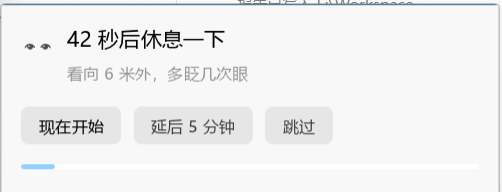
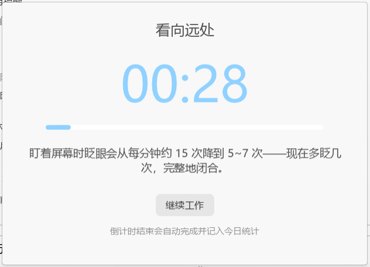
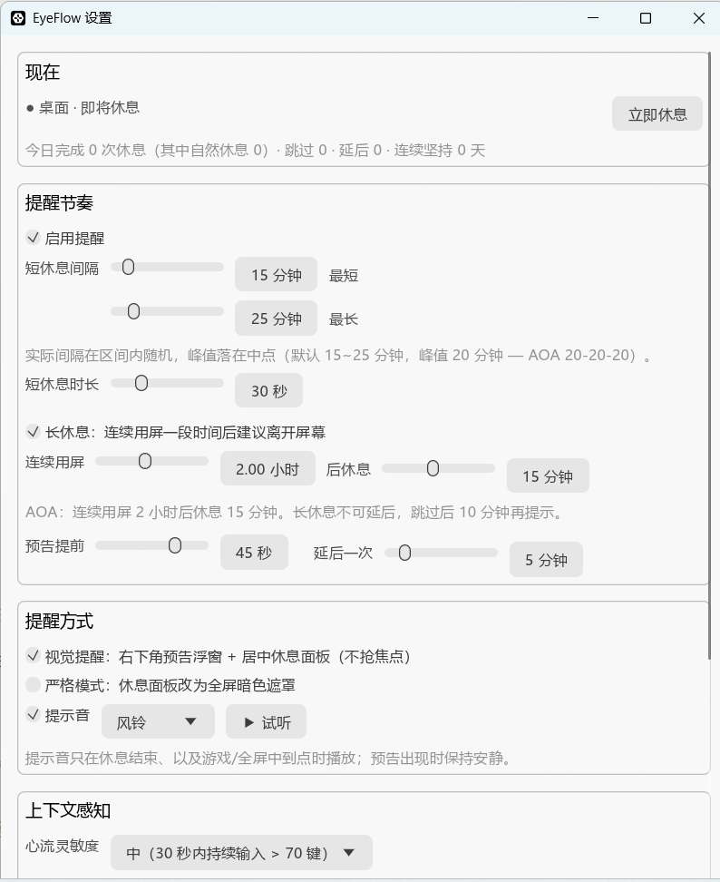
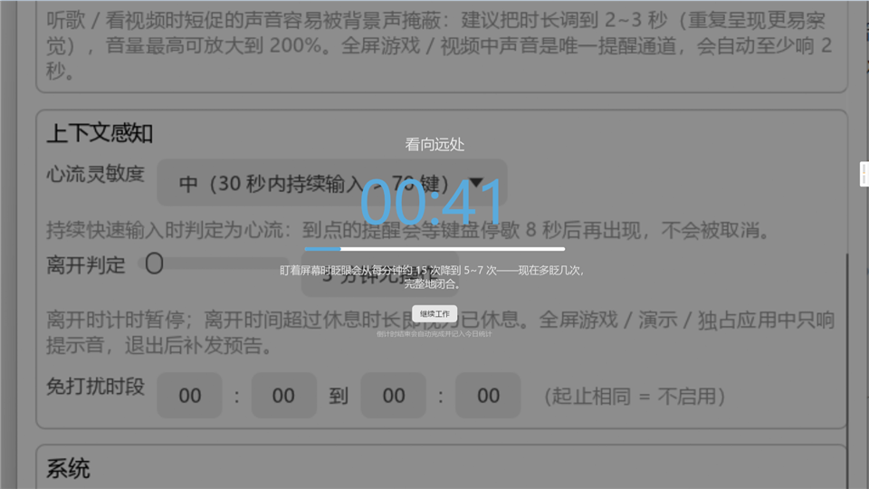

# EyeFlow

**Context-aware eye-care break reminder for Windows · 会看情况的 Windows 护眼提醒**

> Language: [English](#eyeflow) · [中文](#eyeflow-中文版)

EyeFlow is a context-aware eye-care reminder: it knows whether you are deep in a typing flow, in a full-screen game, or away from your desk — so a due reminder is **deferred** to a better moment or shown in a lighter form, and it **never disappears**.

- Free and open source (MIT) · single Rust process · no Electron / WebView
- **Speaks English and Chinese**, and the English mode does not load the 18.8 MB CJK font
- Portable exe **9,085,440 B ≈ 8.66 MB** (v0.5.2 baseline 10,224,640 B, **-1,139,200 B / -11.14%**); a fresh idle process that has never opened the settings window uses **3.15 MB private / 16.20 MB working set** (opening the settings window briefly pushes this to 179–224 MB because of the GL context, and it falls back to 55.14 MB once the window closes — most of that is graphics-driver residue, not our data; see [Memory measurements](#memory-measurements) and [ADR-0006](docs/adr/0006-eframe-on-demand-ui-session.md))

[](https://github.com/lexingtonhibiki/EyeFlow/actions/workflows/ci.yml)
[](https://github.com/lexingtonhibiki/EyeFlow/releases)
[](LICENSE)
[](#download-and-install)

> Note: the repository is written as `https://github.com/lexingtonhibiki/EyeFlow` throughout; the actual created repository is authoritative.

## Screenshots

| Icon | Heads-up window (bottom right, never steals focus) | Break panel (centered) |
|:---:|:---:|:---:|
|  |  |  |

<details>
<summary>Settings window / strict mode with a custom wallpaper</summary>



Strict mode plus a custom background image (cover-fit with a dark overlay); the countdown and the tip are drawn on top of it:



</details>

## Why EyeFlow

Eye-care reminders are not scarce; reminders that fire *at the right moment* are. Competitor research ([docs/research/03-competitor-ux.md](docs/research/03-competitor-ux.md)) concluded: **"people stay because of advance notice + controllable enforcement + visible streaks; people uninstall because of badly timed interruptions."**

- **Stretchly** (free, Electron): full-screen detection unsolved on Windows for six years ([issue #355](https://github.com/hovancik/stretchly/issues/355) — it simply fails inside full-screen apps), high memory and energy use, and no streak tracking;
- **Workrave** (free): its 3-minute default is too frequent, it has no full-screen/context awareness, and forcing a blocking pause annoys some users;
- **LookAway** (commercial): the best context awareness, but macOS-only ($19, one-off) and the Windows version has been "coming soon" for a long time.

**Windows + free + smart silence in full-screen/flow + written in lightweight Rust — that combination is empty in the free market today, and that is where EyeFlow sits.**

| | EyeFlow | Stretchly | Workrave | LookAway |
|---|---|---|---|---|
| Platform | Windows 10/11 x64 | Win/Mac/Linux (Electron) | Win/Linux | macOS only |
| Price | Free, open source (MIT) | Free, open source | Free, open source | $19/$29 one-off |
| Full-screen / gaming | Auto-degrades to cue only, then catches up on exit | Requires hand-written JSON process exclusions | None | Yes (macOS) |
| Flow handling | Deferred until 8 s after typing stops | None | None | Deep focus detection (macOS) |
| Streak tracking | Yes (local `stats.toml`) | None | Yes | Yes |
| Size | ≈ 8.66 MB single file (Rust) | ~100 MB class (Electron) | A few MB | Native |

## Features

- **Context aware**: desktop / flow / gaming / away are detected automatically, and a reminder only shows up at a sensible moment in a sensible form
- **Reminders are deferred, never dropped**: in flow it is delivered in full 8 s after typing pauses; in a game only the cue plays and a heads-up is sent after you exit ([ADR-0002](docs/adr/0002-reminders-are-deferred-never-dropped.md))
- **Two-tier breaks**: short breaks (15–25 min triangular, peak 20 min, 30 s long) + long breaks (after 2 h of continuous screen time → 15 min) ([ADR-0001](docs/adr/0001-aoa-20-20-20-two-tier-breaks.md))
- **Complete reminder chain**: heads-up window (no focus steal) → break panel (countdown + one authoritative eye-care tip) → automatically counted into your streak
- **You are always in control**: postpone 5 min (once per reminder, long breaks included), skip, start now, pause for one hour, do-not-disturb window; today's postpone count is grey / orange / red at 0 / 1–2 / ≥3
- **Strict mode** (optional, off by default): the break panel becomes a full-screen overlay, with your own background image, three fit modes and a live crop preview
- **5 synthesized cues + custom audio**: gentle_chime / soft_tap / water_drop / digital_drop / triple_beep, or your own wav / mp3 / ogg / flac / m4a file (≤ 5 min); volume 50–200 % and length 1–5 s (2–3 s recommended when music or video is playing); silently degrades when there is no audio device
- **Streak tracking**: completed today (short / long / natural), skipped, postponed, and consecutive days
- **Tray + hotkey**: left click / double click opens settings; Ctrl+Shift+E rests now; the tooltip shows the current state and the next break time
- **Lightweight**: a single Rust process, no Electron / WebView; ≈ 8.66 MB exe; normally no window and no GPU context, 3.15 MB private memory measured while idle, with a UI session started only to show a panel or the settings ([ADR-0006](docs/adr/0006-eframe-on-demand-ui-session.md), [Memory measurements](#memory-measurements))
- **Privacy friendly**: fully local, no network, no telemetry, no accounts
- **Single instance**: a second launch simply exits

## The science behind the defaults

The defaults are not guesses; they come from institutional guidance and peer-reviewed research (full review in [docs/research/02-science-evidence.md](docs/research/02-science-evidence.md)):

- **20-20-20**: every 20 minutes, look 6 m (20 ft) away for 20 seconds — from the American Optometric Association's [computer vision syndrome guidance](https://www.aoa.org/healthy-eyes/eye-and-vision-conditions/computer-vision-syndrome). It is also the only cadence backed by both institutional guidance and a directly tested randomized controlled trial ([Talens-Estarelles et al. 2023](https://pubmed.ncbi.nlm.nih.gov/35963776/): digital eye strain and dry-eye symptoms improved significantly after two weeks).
- **2 hours / 15 minutes**: the same AOA guidance asks for a 15-minute eye break after 2 hours of continuous screen time — that is where EyeFlow's long break comes from.
- **A 30-second short break rather than 20**: spontaneous micro-breaks average 27.4 s, and operators often end them before fully recovered ([Henning et al. 1989](https://pubmed.ncbi.nlm.nih.gov/2806221/)); 30 s is closer to natural recovery. The tips remind you both to "look 6 m away" and to "blink a few times" — blinking drops from about 15 times a minute to 5–7 while staring at a screen ([AAO](https://www.aao.org/eye-health/tips-prevention/computer-usage)).
- **No blue-light filter**: a [Cochrane 2023](https://www.cochranelibrary.com/cdsr/doi/10.1002/14651858.CD013244.pub2/full) review of 17 RCTs found blue-light filtering may offer no short-term benefit for eye strain, and the AAO is explicit that there is no evidence screen blue light damages the eyes; it also overlaps with Windows' own night mode. So we deliberately do not do it ([ADR-0003](docs/adr/0003-gentle-by-default-no-bluelight-no-lockdown.md)).
- **No "prevents myopia / protects your eyes" claims**: the AAO positions digital eye strain as temporary, reversible discomfort, and the tips and copy deliberately avoid such claims.

## Download and install

Requirements: Windows 10 / 11, x64. Go to the [Releases](https://github.com/lexingtonhibiki/EyeFlow/releases) page:

### Installer

1. Download `EyeFlow-<version>-Setup.exe` and run it; the options page can create a desktop shortcut and **pick the interface language — Simplified Chinese by default, English optional**;
2. At the end of the install you can choose "launch now"; the install enables autostart by default (you can turn it off in the settings). ⚠️ **The settings window no longer opens by itself on the first run** — the language was already asked during install, so the tray icon is the only entry point (right-click it, "Settings…");
3. Uninstall: Windows "Settings → Apps → Installed apps", or Uninstall EyeFlow from the Start menu (no leftovers: program, config, stats, log, shortcut and registry entries are all cleaned).

> **About SmartScreen**: the installer and the exe are not code-signed yet, so Windows SmartScreen may say "Windows protected your PC" on first run. Click **More info → Run anyway**.

### Portable

Download `eyeflow-<version>-x86_64-portable.zip`, unzip and run; no registry writes. The portable build does **not** enable autostart by default.

### winget (planned)

A manifest for winget-pkgs is planned, after which `winget install eyeflow` will work (see [Roadmap](#roadmap)).

## Usage

### Tray

- **Left click / double click** the icon: open settings;
- **Right-click menu**: Open settings · Enable reminders (checked) · Rest now · Pause for one hour · Sound cue · Quit;
- **Hover tooltip**: the current state and the next break time.

Note: **pause** (the whole reminder feature stops for a while) and **mute** (only the cue is silenced, visual reminders continue) are two different things.

### Global hotkey

- `Ctrl+Shift+E`: rest now. The combination is an OS-level **globally exclusive** resource and may clash with other software; you can turn it off at any time in Settings → System — the tray menu keeps "Rest now" either way.

### The full chain of one reminder

1. **Heads-up window** (bottom right of the screen, on top but never focused): "Break in N s", with **Start now** / **Postpone 5 min** (once per reminder) / **Skip**;
2. **Break panel** (centered, on top, never focused): a large countdown plus one eye-care tip from AOA/AAO; clicking **[Back to work]** counts as a skip; when the countdown runs out the break is **completed** automatically and an end cue plays;
3. **Settlement**: the result is counted into your streak (completed today / skipped / postponed / consecutive days).

Extra rules: a long break can be postponed once and stays long when it arrives; skipping a long break reminds you again after 10 minutes; in strict mode (off by default) the break panel becomes a full-screen overlay, and you can pick a background image and preview the crop in the settings.

### Context behaviour

| Context | How it is detected | Behaviour when due |
|---|---|---|
| Desktop | Default state (not full-screen, low keyboard activity) | Delivered in full: heads-up → break panel |
| Flow | Key count in a 30-second sliding window reaches the threshold (low 40 / medium 70 / high 100, auto-repeat already filtered) | **Deferred**: delivered in full 8 s after typing pauses |
| Gaming / do-not-disturb | SHQueryUserNotificationState (exclusive full-screen / presentation / lock screen …) plus a foreground full-screen window comparison as a fallback | **Cue only, immediately**; a heads-up is sent after you exit |
| Away | No mouse or keyboard input for ≥ 3 min (`away_secs`) | The timer **pauses**; entering the away state counts as one natural break and timing restarts when you return; ≥ 15 min away resets the long-break screen-time accumulator |

Principle: **context may change when and how a reminder is delivered, but never cancel it** (deferral ≠ postponement: deferral is the system pushing back by itself, postponement is you pushing it back).

### Do-not-disturb window

No reminders between 00:00 and 08:00 by default; if a reminder came due during the window, it is delivered 60 seconds after it ends. "Pause for one hour" works the same way.

### Interface language

The interface speaks English and Simplified Chinese. Pick it in **Settings → System → Language**; the choice is saved to `config.toml` as `language = "en-US"` or `language = "zh-CN"` and takes effect immediately — the tray menu, the fonts and every open window switch with it.

Your interface language is decided **in the installer**: the options page asks once, defaulting to Simplified Chinese, and the answer is written into `config.toml` before EyeFlow ever starts. Your Windows display language is consulted only when there is no `config.toml` at all — the portable exe, or a `config.toml` you deleted. Anything that is not an `en` prefix falls back to Chinese, and an unrecognized value is left in your file untouched rather than being silently rewritten.

English mode loads Segoe UI instead of the 18.8 MB Chinese font, so switching languages also drops the largest single chunk of the settings-window memory peak.

## Configuration file

The file lives at `%APPDATA%\eyeflow\config.toml`; the settings UI is the recommended way to change it, but hand-editing works just as well. If parsing fails, the original file is backed up as `config.toml.bak-corrupt-<timestamp>` and rebuilt with defaults; if a v0.1 layout is detected (`min_interval_secs` and friends) it is migrated automatically — the values you changed are carried over, old defaults are replaced by the new evidence-based ones, and the original is backed up as `config.toml.bak-v0.1-<timestamp>`.

```toml
enabled = true                 # master switch (same as "Enable reminders" in the tray)
short_break_min_secs = 900     # short break interval, lower bound (15 min)
short_break_max_secs = 1500    # short break interval, upper bound (25 min; triangular, peak 20 min)
short_break_secs = 30          # short break length (s)
long_break_enabled = true      # whether the long break is enabled
long_break_after_secs = 7200   # continuous screen time before a long break (2 h)
long_break_secs = 900          # long break length (15 min)
heads_up_secs = 15             # heads-up lead time (s; the long break warns 30 s ahead)
postpone_secs = 300            # postpone length (5 min; at most one postponement per reminder)
sound_enabled = true           # cue on/off
sound_preset = "gentle_chime"  # cue preset: gentle_chime / soft_tap / water_drop / digital_drop / triple_beep / custom
# custom_sound_path            # optional; this line is absent when unset (Option<String>, not an empty string); used when sound_preset = "custom" (wav / mp3 / ogg / flac / m4a / aac, ≤ 5 min)
cue_volume_pct = 100           # cue volume 50~200% (>100 actively amplifies, for music/video)
cue_duration_secs = 1          # cue length 1~5 s (short patterns loop to fill it; in full-screen, sound is the only channel, so it is stretched to at least 2 s)
hotkey_enabled = true          # global hotkey Ctrl+Shift+E (rest now); it takes the combination globally and can be turned off
visual_enabled = true          # visual reminders (heads-up window + break panel); cue only when off
strict_mode = false            # strict mode: the break panel becomes a full-screen overlay
# strict_wallpaper_path        # optional; this line is absent when unset (Option<String>, not an empty string); strict mode background image (png / jpg / webp / bmp / gif), plain dark when unset
strict_wallpaper_fit = "cover" # background fit: cover (fill and crop) / contain (fit whole) / stretch
strict_overlay_pct = 55        # strict mode overlay opacity 0~85%
strict_overlay_gradient = false # overlay uses a top-dark, bottom-light vertical gradient
start_cue_enabled = true       # play a cue when clicking "Start now" / "Rest now"
esc_skip_enabled = true        # press Esc during a break to skip (unavailable in strict mode)
update_check_enabled = false   # check for updates at startup (at most once every 24 h, GitHub Releases API only, nothing is downloaded)
# update_last_checked         # optional; the Unix timestamp of the last update check, maintained by the program (Option<u64>)
quiet_start = "00:00"          # do-not-disturb window start
quiet_end = "08:00"            # do-not-disturb window end
flow_sensitivity = "Medium"    # flow detection sensitivity: Low / Medium / High
away_secs = 180                # no input for this long counts as away (s)
language = "zh-CN"             # interface language: zh-CN / en-US (any "en" prefix means English)
```

### Statistics file

Streaks live in `%APPDATA%\eyeflow\stats.toml` and record: completed today (short / long / natural), skips, postponements and consecutive days. They are cleaned up on uninstall.

## Building from source

Requirements:

- **Rust ≥ 1.95** (via [rustup](https://rustup.rs/); either the MSVC or the GNU toolchain works):
  - MSVC toolchain: needs Visual Studio Build Tools (uses `rc.exe` to embed the icon and version resources);
  - GNU toolchain: needs MinGW's `windres` to embed the icon;
- **NSIS 3** (optional): only needed to build the installer.

```bat
git clone https://github.com/lexingtonhibiki/EyeFlow.git
cd eyeflow
cargo build --release
:: artifact: target\release\eyeflow.exe (about 8.66 MB)

:: when you want the online update check (the default build ships no TLS stack, saving 1.1 MB):
cargo build --release --features update-check

:: one-shot build + package (emits dist\EyeFlow-<version>-Setup.exe when NSIS is found):
build-release.cmd

:: demo / acceptance mode: opens the settings window on launch, fires a reminder after 60 s (heads-up 45 s), touches no config file
set EYEFLOW_DEMO=1 && target\release\eyeflow.exe
```

`cargo test` covers the scheduling core (deferral / catch-up / postponement / long break / away / do-not-disturb), config migration, statistics and audio synthesis, plus the i18n data layer, glyph coverage and the bilingual README: **77 cases** in total.

CI runs `cargo test --locked` and `cargo build --release --locked`; pushing a `v*.*.*` tag builds the installer, the portable zip and a SHA256 and publishes them to Releases (see `.github/workflows/release.yml`).

## Memory measurements

What Task Manager shows is a single number, "private working set", which mixes **our own memory** with **the heap the graphics driver leaves behind after a window closes**. This table separates the two; the figures are measured on this machine for v0.5.2 (a fresh process that never opened the settings window, and a long-running installed instance), not estimated.

| State | Working set | Private memory | Whose is it |
|---|---:|---:|---|
| Fresh process, idle (settings window never opened) | 16.20 MB | **3.15 MB** | **Almost all of it is EyeFlow's own** — no GL context, no window |
| Settings window open (steady state) | 154–200 MB | 179–224 MB | Mostly the OpenGL driver context allocated for this process, plus driver heap |
| After the settings window closes | 81.07 MB | 55.14 MB | **Mostly driver heap residue**, not our data |
| Installed instance (running for 24.8 h) | 15.88 MB | 77.41 MB | Same, and **71% of the residue (46.70 MB) is the one-time GL context + NVIDIA driver init**: the process module count goes 39 → 85 → 76 and then stays at 76; of the ~8 MB left, strict mode and wallpaper contribute **exactly 0** |

**How to read this table:**

- **Our own resident cost is 3.15 MB private** — tray + scheduling core + a windowless polling loop. That is the accurate number behind the "lightweight" claim.
- **The ~200 MB while the settings window is open is not resident**; it is released when the window closes (the GL context is destroyed with it). That is exactly why this project does not keep a WebView alive ([ADR-0006](docs/adr/0006-eframe-on-demand-ui-session.md)).
- **The 55 MB left after closing is a heap the graphics driver did not give back to the operating system**; the project cannot reclaim it from user space (it does not belong to our allocator). `docs/adr/0006` and `docs/lessons.md` §4 have measured the same phenomenon for a long time.
- **For comparison**: Electron-class competitors sit at 100–200 MB resident on Windows, **even with not a single window open**.

We do not claim "back to zero after closing the window" — that would require redrawing the panels and the overlay in native Win32 (GDI / Direct2D), and it is on the Roadmap. v0.6 lowers the in-session peak in English mode (the 18.8 MB Chinese font is no longer loaded); the exact figures are in the release notes.

## Uninstalling and cleaning data

The **installer** uninstaller (Windows "Settings → Apps" or the Start menu) cleans up:

- the program directory `%LOCALAPPDATA%\EyeFlow\` (eyeflow.exe and the uninstaller);
- the Start menu shortcut;
- the autostart entry and the "Add or Remove Programs" registry entry (both under HKCU, no administrator needed);
- user data `%APPDATA%\eyeflow\`: `config.toml`, `stats.toml` and any `config.toml.bak-*` backups.

**Portable**: end the process and delete the exe; `%APPDATA%\eyeflow\` can be deleted too. Autostart can be turned off at any time in the settings or in Task Manager → Startup.

## Privacy

EyeFlow **makes no network requests by default**: no telemetry, no accounts, no automatic downloads. All the data is two files (`config.toml` and `stats.toml`), both stored locally in `%APPDATA%\eyeflow\`. Keyboard monitoring only records key timestamps inside this process for flow detection — never key contents, never written to disk, never uploaded.

The only optional network feature is the **update check** (Settings → System, off by default): when enabled it queries the GitHub Releases API (`api.github.com/repos/lexingtonhibiki/EyeFlow/releases/latest`) at most once every 24 hours, only compares version numbers, shows the result in the settings window, and downloads or installs nothing.

## Roadmap

- [x] "Welcome back" feedback after a completed break; Esc to skip during a break
- [ ] **Interface language**: shipped in v0.6 (English and Simplified Chinese, switchable at runtime)
- [ ] Multi-monitor: the break panel / strict mode overlay should cover every screen
- [ ] A complete power / lock event bridge (sleeping for more than 10 minutes is already treated as being away)
- [ ] Custom global hotkeys
- [ ] Toast / system notifications as an auxiliary reminder channel
- [ ] winget package (`winget install eyeflow`)
- [ ] Redraw the panels in native Win32 (GDI / Direct2D) to get rid of the GL context and the driver's memory residue
- [ ] `MsgWaitForMultipleObjectsEx` in the light loop, to bring the worst-case tray response latency back from 1 s to near zero

## Contributing

The branch model (`main` stable / `dev` integration / `feature/*` work), the release process and the development conventions are in [CONTRIBUTING.md](CONTRIBUTING.md).

## Design and decision records

Every key decision in EyeFlow has a numbered ADR and supporting research:

| Document | What it covers |
|---|---|
| [CONTEXT.md](CONTEXT.md) | Domain glossary (precise definitions of reminder / heads-up / postpone / defer / catch-up …) |
| [docs/spec.md](docs/spec.md) | Specification |
| [ADR-0001](docs/adr/0001-aoa-20-20-20-two-tier-breaks.md) | Default rhythm follows AOA 20-20-20 with two-tier breaks |
| [ADR-0002](docs/adr/0002-reminders-are-deferred-never-dropped.md) | Reminders are only late, never gone (deferral + catch-up) |
| [ADR-0003](docs/adr/0003-gentle-by-default-no-bluelight-no-lockdown.md) | Gentle by default; no blue-light filtering and no forced lockdown |
| [ADR-0004](docs/adr/0004-interruptibility-via-shqueryusernotificationstate.md) | Interruptibility detection via SHQueryUserNotificationState |
| [ADR-0005](docs/adr/0005-autostart-hkcu-run-default-on.md) | Autostart via HKCU\Run, on by default for the installer |
| [ADR-0006](docs/adr/0006-eframe-on-demand-ui-session.md) | UI host: an on-demand eframe session, no GL context while idle (with memory measurements) |
| [ADR-0007](docs/adr/0007-v0.6-scope.md) | v0.6 scope ruling: bilingual + one real size cut + zero-risk micro-optimizations |
| [ADR-0008](docs/adr/0008-i18n-self-built-tr-layer.md) | i18n: build-time key validation + a `tr(&str)` lookup + Segoe UI for English |
| [docs/portability-notes.md](docs/portability-notes.md) | Cross-platform porting path and memory/maintenance cost assessment (Qt, UPX trade-offs) |
| [docs/report-v0.3.md](docs/report-v0.3.md) | v0.3: the basis for cue volume/length (ISO 7731, WCAG 1.4.7), a hotkey that can be turned off, no uninstall residue, settings window size |
| [docs/report-v0.4.md](docs/report-v0.4.md) | v0.4: custom cues, strict mode wallpaper and crop preview, postponing a long break, update check evaluation, GitHub e-mail privacy |
| [docs/research/](docs/research/) | Scientific evidence (02), competitor UX (03), Windows UX guidelines (04), release migration (06) and more |

## License

[MIT](LICENSE) © 2026 lexingtonhibiki

---

# EyeFlow 中文版

**Context-aware eye-care break reminder for Windows · 会看情况的 Windows 护眼提醒**

EyeFlow 是一款"会看情况的护眼提醒"工具:它知道你正打字进入心流、在全屏游戏、还是已经离开座位——到点的提醒只会**顺延**到更合适的时机、换一种更轻的形态,而**不会消失**。

- 免费开源(MIT) · Rust 单进程 · 无 Electron / WebView
- **界面支持中英双语**,而且说英语的时候不加载 18.8 MB 的中文字体
- 便携 exe **9,085,440 B 约 8.66 MB**(v0.5.2 基线 10,224,640 B,**-1,139,200 B / -11.14%**);未打开过窗口的全新进程空闲时 **3.15 MB 私有 / 16.20 MB 工作集**(打开设置窗时因 GL 上下文短暂升至 179~224 MB,关闭后回落到 55.14 MB——其中大部分是显卡驱动残留,不是我们的数据;完整拆解见[内存实测](#内存实测)与 [ADR-0006](docs/adr/0006-eframe-on-demand-ui-session.md))

> 说明:本文仓库地址均写作 `https://github.com/lexingtonhibiki/EyeFlow`,以实际创建的仓库为准。

## 界面预览

| 图标 | 预告浮窗(右下角,不抢焦点) | 休息界面(居中) |
|:---:|:---:|:---:|
|  |  |  |

<details>
<summary>设置窗口 / 严格模式自选壁纸</summary>


严格模式 + 自选背景图片(铺满裁剪 + 暗色蒙层),倒计时与贴士叠在图上:


</details>

## 为什么是 EyeFlow

市面上不缺护眼提醒,缺的是"时机选得对"的护眼提醒。竞品调研([docs/research/03-competitor-ux.md](docs/research/03-competitor-ux.md))的结论是:**"用户留下来靠预告 + 可控的强制 + 可见的坚持记录;用户卸载靠时机不对的打断。"**

- **Stretchly**(免费开源,Electron):Windows 上全屏检测六年未解决([issue #355](https://github.com/hovancik/stretchly/issues/355),全屏应用中直接失灵),内存与能耗偏高,且没有坚持统计;
- **Workrave**(免费开源):默认 3 分钟一次过于频繁,无全屏/上下文感知,强制阻挡键鼠让部分用户不适;
- **LookAway**(商业):上下文感知做得最好,但 macOS 专属($19 买断),Windows 版长期"coming soon"。

**Windows + 免费 + 全屏/心流智能静默 + Rust 轻量——这个组合在免费市场目前是空白,EyeFlow 正好落在这里。**

| | EyeFlow | Stretchly | Workrave | LookAway |
|---|---|---|---|---|
| 平台 | Windows 10/11 x64 | Win/Mac/Linux(Electron) | Win/Linux | 仅 macOS |
| 价格 | 免费开源(MIT) | 免费开源 | 免费开源 | $19/$29 买断 |
| 全屏/游戏处理 | 自动降级:仅提示音,退出后补发预告 | 需手写 JSON 进程排除 | 无 | 有(macOS) |
| 心流处理 | 顺延到停歇 8 秒后投递 | 无 | 无 | 深度专注检测(macOS) |
| 坚持统计 | 有(本地 stats.toml) | 无 | 有 | 有 |
| 体积 | 单文件约 8.66 MB(Rust) | 约 100 MB 级(Electron) | 数 MB | 原生 |

## 功能特性

- **上下文感知**:桌面 / 心流 / 游戏 / 离开 四态自动切换,提醒只在合适的时机、以合适的形态出现
- **提醒只顺延、不消失**:心流中顺延到输入停歇 8 秒后完整投递;游戏中只响提示音,退出全屏后补发预告([ADR-0002](docs/adr/0002-reminders-are-deferred-never-dropped.md))
- **双层休息**:短休息(15~25 分钟三角随机、峰值 20 分钟、持续 30 秒)+ 长休息(连续用屏 2 小时 → 15 分钟)([ADR-0001](docs/adr/0001-aoa-20-20-20-two-tier-breaks.md))
- **完整提醒链路**:预告浮窗(不抢焦点)→ 休息界面(倒计时 + 一条权威护眼贴士)→ 自动计入坚持统计
- **用户始终可控**:延后 5 分钟(每次提醒限 1 次,长休息同样可延后)、跳过、立即开始、暂停 1 小时、免打扰时段;今日延后次数在设置窗按 0 / 1~2 / ≥3 次灰 / 橙 / 红着色
- **严格模式**(可选,默认关):休息界面变为全屏遮罩,可自选背景图片,三种自适应方式 + 实时裁剪预览
- **5 种合成提示音 + 自定义音频**:gentle_chime / soft_tap / water_drop / digital_drop / triple_beep,或自选 wav / mp3 / ogg / flac / m4a 文件(≤ 5 分钟);音量 50%~200%、时长 1~5 秒可调(听歌 / 看视频时建议 2~3 秒);无音频设备自动降级为静音
- **坚持统计**:今日完成(短/长/自然)、跳过、延后次数、连续坚持天数
- **托盘 + 热键**:左键单击/双击打开设置;Ctrl+Shift+E 立即休息;tooltip 显示当前状态与下次休息时间
- **界面语言**:设置 → 系统 → 语言 里随时切换简体中文 / English,托盘、字体、已打开的窗口立即跟着换
- **轻量**:Rust 单进程,无 Electron / WebView;exe 约 8.66 MB;平时没有任何窗口和 GPU 上下文,空闲私有内存实测 3.15 MB,只在显示浮窗 / 设置时才短暂启动 UI 会话([ADR-0006](docs/adr/0006-eframe-on-demand-ui-session.md),[内存实测](#内存实测))
- **隐私友好**:纯本地运行,无网络、无遥测、无账号
- **单实例**:重复启动直接退出

## 科学依据

默认参数不是拍脑袋,而是取自机构指南与同行评审研究(完整调研见 [docs/research/02-science-evidence.md](docs/research/02-science-evidence.md)):

- **20-20-20**:每 20 分钟看 6 米(20 英尺)外 20 秒——出自美国验光协会(AOA)的[计算机视综合征指南](https://www.aoa.org/healthy-eyes/eye-and-vision-conditions/computer-vision-syndrome)。它也是唯一同时有机构指南背书与随机对照试验直接检验的节奏([Talens-Estarelles et al. 2023](https://pubmed.ncbi.nlm.nih.gov/35963776/):执行 2 周后数字视疲劳与干眼症状显著改善)。
- **2 小时 / 15 分钟**:AOA 同一指南要求连续用屏 2 小时后休息眼睛 15 分钟——EyeFlow 的长休息由此而来。
- **短休息默认 30 秒而非 20 秒**:自发微休息的平均时长是 27.4 秒,且操作者常在完全恢复前提前结束([Henning et al. 1989](https://pubmed.ncbi.nlm.nih.gov/2806221/));30 秒更接近自然恢复量。休息贴士会同时提醒"看 6 米外"与"多眨几次眼"——盯着屏幕时眨眼会从每分钟约 15 次降到 5~7 次([AAO](https://www.aao.org/eye-health/tips-prevention/computer-usage))。
- **不做蓝光滤镜**:[Cochrane 2023](https://www.cochranelibrary.com/cdsr/doi/10.1002/14651858.CD013244.pub2/full) 对 17 项 RCT 的综述显示蓝光过滤对视疲劳可能没有短期获益,AAO 也明确"无证据表明屏幕蓝光损伤眼睛";且与 Windows 自带"夜间模式"重叠。因此明确不做([ADR-0003](docs/adr/0003-gentle-by-default-no-bluelight-no-lockdown.md))。
- **不做"防近视 / 防眼损伤"承诺**:AAO 将数字视疲劳定位为暂时性、可逆的不适,护眼贴士与文案刻意避开此类表述。

## 下载安装

系统要求:Windows 10 / 11,x64。前往 [Releases](https://github.com/lexingtonhibiki/EyeFlow/releases) 页面:

### 安装版

1. 下载 `EyeFlow-<版本>-Setup.exe` 并运行;安装选项页可勾选是否创建桌面快捷方式,并**选择界面语言(默认中文简体,可选 English)**;
2. 安装完成时可选"立即启动";安装默认写入开机自启(可在设置界面关闭)。⚠️ **首次运行不再自动打开设置窗**——语言已在安装器里问过,托盘图标成为唯一入口(右键托盘图标 →「打开设置…」);
3. 卸载:系统"设置 → 应用 → 安装的应用",或开始菜单中的 Uninstall EyeFlow(无残留:程序、配置、统计、日志、快捷方式、注册表项全部清理)。

> **关于 SmartScreen**:安装包与 exe 目前未做代码签名,首次运行时 Windows SmartScreen 可能提示"Windows 已保护你的电脑"。请点击 **更多信息 → 仍要运行**。

### 便携版

下载 `eyeflow-<版本>-x86_64-portable.zip`,解压即用,不写注册表;便携运行默认**不**写开机自启。

### winget(计划中)

计划向 winget-pkgs 提交清单,届时可直接 `winget install eyeflow`(见 [Roadmap](#roadmap))。

## 使用说明

### 托盘

- **左键单击 / 双击**图标:打开设置;
- **右键菜单**:打开设置 · 启用提醒(勾选) · 立即休息 · 暂停 1 小时 · 提示音 · 退出;
- **悬停 tooltip**:当前状态与下次休息时间。

注意:**暂停**(整个提醒功能停止一段时间)与**静音**(只关闭提示音,视觉提醒照常)是两件事。

### 全局热键

- `Ctrl+Shift+E`:立即休息。组合键是操作系统级**全局独占**资源,可能与其他软件冲突,可在设置 → 系统 中随时关闭;关闭后托盘菜单的“立即休息”不受影响。

### 一次提醒的完整链路

1. **预告浮窗**(屏幕右下角,置顶但不抢焦点):"N 秒后休息一下",可选 **现在开始** / **延后 5 分钟**(每次提醒限 1 次)/ **跳过**;
2. **休息界面**(屏幕居中,置顶不抢焦点):大倒计时 + 一条来自 AOA/AAO 的护眼贴士;点击 **[继续工作]** 记为跳过;倒计时走完自动**完成**并播结束音;
3. **结算**:本次结果计入坚持统计(今日完成 / 跳过 / 延后 / 连续坚持天数)。

补充规则:长休息可延后一次,到点后仍是长休息;跳过长休息后 10 分钟会再次提示;严格模式(默认关)下休息界面变为全屏遮罩,可在设置里选一张背景图片并预览裁剪效果。

### 上下文行为

| 上下文 | 如何判定 | 到点行为 |
|---|---|---|
| 桌面 | 默认状态(非全屏、键盘活动低) | 完整投递:预告 → 休息界面 |
| 心流 | 30 秒滑窗按键数达阈值(低 40 / 中 70 / 高 100,已过滤按键自动重复) | **顺延**:等输入停歇 8 秒后完整投递 |
| 游戏 / 不可打扰 | SHQueryUserNotificationState(独占全屏 / 演示 / 锁屏等)+ 前台全屏窗口比对兜底 | **立即仅响提示音**;退出后补发预告 |
| 离开 | 无鼠标键盘输入 ≥ 3 分钟(away_secs) | 计时**暂停**;进入离开状态即视为一次自然休息,回来后重新计时;离开 ≥ 15 分钟清零长休息的用屏累计 |

原则:**上下文只能改变提醒的投递时机与形态,不能取消提醒**(顺延 ≠ 延后:顺延是系统自动推后,延后是你主动推迟)。

### 免打扰时段

默认 00:00–08:00 不提醒;时段结束后若提醒已到点,将在 60 秒后投递。"暂停 1 小时"同理。

### 界面语言

界面支持简体中文与 English。在**设置 → 系统 → 语言**里切换,选择会写进 `config.toml` 的 `language = "zh-CN"` / `language = "en-US"`,并且**立即生效**——托盘菜单、字体、已打开的窗口一起换。

界面语言**在安装器里定**:安装选项页问一次(默认中文简体,可选 English),装完就把答案写进 `config.toml`,应用启动时读的是这个值。只有**根本没有 config.toml** 时才去看 Windows 的显示语言 —— 也就是便携版,或你自己把 config.toml 删了的情况。任何不以 `en` 开头的值都回落中文;无法识别的值**原样保留在你的文件里**,不会被悄悄改写。

切到英文会用 Segoe UI 换掉 18.8 MB 的中文字体,顺带把设置窗内存峰值里最大的一块也降下来。

## 配置文件

配置位于 `%APPDATA%\eyeflow\config.toml`,推荐通过设置界面修改;手工编辑同样有效。解析失败时原文件会备份为 `config.toml.bak-corrupt-<时间戳>` 后以默认值重建;检测到 v0.1 旧格式(`min_interval_secs` 等字段)时会自动迁移——你改过的间隔与免打扰时段带过来,旧默认值换成新的循证默认值,原文件备份为 `config.toml.bak-v0.1-<时间戳>`。

```toml
enabled = true                 # 提醒总开关(与托盘"启用提醒"一致)
short_break_min_secs = 900     # 短休息间隔下限(15 分钟)
short_break_max_secs = 1500    # 短休息间隔上限(25 分钟;三角分布,峰值 20 分钟)
short_break_secs = 30          # 短休息时长(秒)
long_break_enabled = true      # 是否启用长休息
long_break_after_secs = 7200   # 连续用屏多久触发长休息(2 小时)
long_break_secs = 900          # 长休息时长(15 分钟)
heads_up_secs = 15             # 预告提前量(秒;长休息预告为 30 秒)
postpone_secs = 300            # 延后时长(5 分钟;每次提醒最多延后 1 次)
sound_enabled = true           # 提示音开关
sound_preset = "gentle_chime"  # 提示音预设:gentle_chime / soft_tap / water_drop / digital_drop / triple_beep / custom
# custom_sound_path            # 可选,未设置时本行不出现(Option<String>,不是空串);sound_preset = "custom" 时使用(wav / mp3 / ogg / flac / m4a / aac,≤ 5 分钟)
cue_volume_pct = 100           # 提示音音量 50~200%(>100 为主动放大,适配音乐/视频场景)
cue_duration_secs = 1          # 提示音时长 1~5 秒(短图案循环铺满;全屏时声音是唯一通道,自动至少 2 秒)
hotkey_enabled = true          # 全局热键 Ctrl+Shift+E(立即休息);会全局独占组合键,可关闭
visual_enabled = true          # 视觉提醒(预告浮窗 + 休息界面);关闭后仅声音
strict_mode = false            # 严格模式:休息界面变为全屏遮罩
# strict_wallpaper_path        # 可选,未选择图片时本行不出现(Option<String>,不是空串);严格模式背景图片(png / jpg / webp / bmp / gif),未选时为纯暗色
strict_wallpaper_fit = "cover" # 背景自适应:cover(铺满裁剪)/ contain(完整显示)/ stretch(拉伸)
strict_overlay_pct = 55        # 严格模式蒙层浓度 0~85%
strict_overlay_gradient = false # 蒙层用上深下浅的垂直渐变
start_cue_enabled = true       # 点击"现在开始/立即休息"时播放提示音
esc_skip_enabled = true        # 休息中按 Esc 跳过(严格模式下不可用)
update_check_enabled = false   # 启动时检查更新(每 24 小时至多一次,仅访问 GitHub Releases API,不下载文件)
# update_last_checked         # 可选;上次检查更新的 Unix 时间戳,由程序维护(Option<u64>)
quiet_start = "00:00"          # 免打扰时段开始
quiet_end = "08:00"            # 免打扰时段结束
flow_sensitivity = "Medium"    # 心流判定灵敏度:Low / Medium / High
away_secs = 180                # 无输入多久判定为离开(秒)
language = "zh-CN"             # 界面语言:zh-CN / en-US(凡以 "en" 开头一律视为英文)
```

### 统计文件

坚持统计位于 `%APPDATA%\eyeflow\stats.toml`,记录:今日完成(短休息 / 长休息 / 自然休息)、跳过次数、延后次数、连续坚持天数。卸载时会一并清理。

## 从源码构建

前置要求:

- **Rust ≥ 1.95**(经 [rustup](https://rustup.rs/) 安装;MSVC 或 GNU 工具链均可):
  - MSVC 工具链:需要 Visual Studio Build Tools(用 `rc.exe` 嵌入图标与版本资源);
  - GNU 工具链:需要 MinGW 的 `windres` 嵌入图标;
- **NSIS 3**(可选):仅在需要生成安装包时使用。

```bat
git clone https://github.com/lexingtonhibiki/EyeFlow.git
cd eyeflow
cargo build --release
:: 产物:target\release\eyeflow.exe(约 8.66 MB)

:: 需要在线更新检查时(默认构建不带 TLS 栈,省 1.1 MB):
cargo build --release --features update-check

:: 一键构建 + 打包(检测到 NSIS 时输出 dist\EyeFlow-<版本>-Setup.exe):
build-release.cmd

:: 演示 / 验收模式:启动即打开设置窗,60 秒后触发一次提醒(预告 45 秒),不改动配置文件
set EYEFLOW_DEMO=1 && target\release\eyeflow.exe
```

`cargo test` 覆盖调度核心(顺延 / 补发 / 延后 / 长休息 / 离开 / 免打扰)、配置迁移、统计与音频合成,外加 i18n 数据层、字形覆盖与双语 README,共 **77** 个用例。

CI 会跑 `cargo test --locked` 与 `cargo build --release --locked`;推送 `v*.*.*` 标签时自动构建安装包、便携 zip 与 SHA256 并发布到 Releases(见 `.github/workflows/release.yml`)。

## 内存实测

任务管理器里看到的是"私有工作集"这一个数字,它把**我们的内存**和**显卡驱动在窗口关闭后留下的堆**混在一起报出来。这张表把两者拆开,数据是 v0.5.2 在本机的实测值(未打开过设置窗的全新进程 / 已装版长开实例),不是估算。

| 状态 | 工作集 | 私有内存 | 归属 |
|---|---:|---:|---|
| 全新进程,空闲(从未打开过设置窗) | 16.20 MB | **3.15 MB** | **几乎全是 EyeFlow 自己的**——此时没有 GL 上下文、没有窗口 |
| 设置窗打开(稳态) | 154~200 MB | 179~224 MB | 绝大部分是 OpenGL 驱动为该进程分配的上下文 + 驱动堆 |
| 设置窗关闭之后 | 81.07 MB | 55.14 MB | **主要是驱动堆残留**,不是我们的数据 |
| 装版实例(已运行 24.8 小时) | 15.88 MB | 77.41 MB | 同上,且**残渣的 71%(46.70 MB)是 GL 上下文与 NVIDIA 驱动的一次性初始化**:进程模块数 39→85→76 后恒定;剩余约 8 MB 中严格模式与壁纸贡献**精确为 0** |

**怎么读这张表:**

- **我们自己的常驻成本是 3.15 MB 私有**——托盘 + 调度核心 + 一个无窗口的轮询循环。这是"轻量"这个卖点的准确数字。
- **打开设置窗时的那 200 MB 不是常驻**,窗口一关就释放(GL 上下文随之销毁),这正是本项目不用常驻 WebView 的原因([ADR-0006](docs/adr/0006-eframe-on-demand-ui-session.md))。
- **关窗后剩下的 55 MB 是显卡驱动没还给操作系统的堆**,项目自己无法从用户态取回(它不属于我们的分配器)。`docs/adr/0006` 与 `docs/lessons.md` §4 早已实测记录过同一现象。
- **对比参考**:Electron 类竞品在 Windows 上常驻 100~200 MB,**即使一个窗口都不开**。

我们不宣称"关窗后回到 0"——那需要把浮窗与遮罩改成 Win32 自绘(GDI/Direct2D),已列入 Roadmap。v0.6 的 i18n 工作会进一步降低英文模式下的会话内峰值(不再加载 18.8 MB 的中文字体),该数字以发布说明为准。

## 卸载与数据清理

**安装版**卸载程序(系统"设置 → 应用"或开始菜单)会清理:

- 程序目录 `%LOCALAPPDATA%\EyeFlow\`(eyeflow.exe 与卸载器);
- 开始菜单快捷方式;
- 开机自启项与"添加或删除程序"注册表项(均在 HKCU,无需管理员);
- 用户数据 `%APPDATA%\eyeflow\`:`config.toml`、`stats.toml` 及 `config.toml.bak-*` 备份。

**便携版**:结束进程后删除 exe 即可;如有 `%APPDATA%\eyeflow\` 可一并删除。开机自启也可在设置界面或任务管理器"启动应用"中随时关闭。

## 隐私

EyeFlow **默认不发起任何网络请求**:无遥测、无账号、无自动下载。全部数据只有两个文件(`config.toml` 与 `stats.toml`),都保存在本机 `%APPDATA%\eyeflow\`。键盘监测仅在本进程内记录按键时间戳用于心流判定——不记录按键内容、不写盘、不上传。

唯一的可选联网功能是**更新检查**(设置 → 系统,默认关闭):开启后每 24 小时至多访问一次 GitHub Releases API(`api.github.com/repos/lexingtonhibiki/EyeFlow/releases/latest`),只比对版本号并在设置窗提示,不下载、不安装任何文件。

## Roadmap

- [x] 休息完成"欢迎回来"反馈;休息中按 Esc 跳过
- [x] **界面语言**:v0.6 落地(简体中文 / English,运行时可切)
- [ ] 多显示器:休息界面 / 严格模式遮罩覆盖所有屏幕
- [ ] 完整的电源 / 锁屏事件桥(睡眠超 10 分钟已自动按离席处理)
- [ ] 自定义全局热键
- [ ] Toast / 系统通知作为辅助提醒通道
- [ ] winget 包(`winget install eyeflow`)
- [ ] 浮窗改为 Win32 自绘(GDI/Direct2D),彻底摆脱 GL 上下文,消除显卡驱动的内存残留
- [ ] 轻量循环改用 `MsgWaitForMultipleObjectsEx`,把托盘点击最坏 1 秒的响应延迟压回接近 0

## 贡献

分支模型(`main` 稳定 / `dev` 集成 / `feature/*` 工作)、发布流程与开发约定见 [CONTRIBUTING.md](CONTRIBUTING.md)。

## 设计与决策记录

EyeFlow 的关键决策都有编号的决策记录(ADR)与调研支撑:

| 文档 | 内容 |
|---|---|
| [CONTEXT.md](CONTEXT.md) | 领域词汇表(提醒 / 预告 / 延后 / 顺延 / 补发… 的准确定义) |
| [docs/spec.md](docs/spec.md) | 规格文档 |
| [ADR-0001](docs/adr/0001-aoa-20-20-20-two-tier-breaks.md) | 默认节奏采用 AOA 20-20-20 双层休息 |
| [ADR-0002](docs/adr/0002-reminders-are-deferred-never-dropped.md) | 提醒只会迟到、不会消失(顺延 + 补发) |
| [ADR-0003](docs/adr/0003-gentle-by-default-no-bluelight-no-lockdown.md) | 默认温和;不做蓝光过滤与强制锁定 |
| [ADR-0004](docs/adr/0004-interruptibility-via-shqueryusernotificationstate.md) | 可打扰性判定用 SHQueryUserNotificationState |
| [ADR-0005](docs/adr/0005-autostart-hkcu-run-default-on.md) | 开机自启用 HKCU\Run,安装默认开启 |
| [ADR-0006](docs/adr/0006-eframe-on-demand-ui-session.md) | UI 宿主:按需启动的 eframe 会话,空闲时不持有 GL 上下文(含内存实测) |
| [ADR-0007](docs/adr/0007-v0.6-scope.md) | v0.6 范围裁决:双语 + 一次真正的体积削减 + 零风险微优化 |
| [ADR-0008](docs/adr/0008-i18n-self-built-tr-layer.md) | i18n:build 期 key 校验 + `tr(&str)` 查表 + 英文用 Segoe UI |
| [docs/portability-notes.md](docs/portability-notes.md) | 跨平台移植路径与内存/维护成本评估(Qt、UPX 取舍) |
| [docs/report-v0.3.md](docs/report-v0.3.md) | v0.3:提示音音量/时长的依据(ISO 7731、WCAG 1.4.7)、热键可关闭、卸载无残留、设置窗尺寸 |
| [docs/report-v0.4.md](docs/report-v0.4.md) | v0.4:自定义提示音、严格模式壁纸与裁剪预览、长休息可延后、更新检查评估、GitHub 邮箱隐私处理 |
| [docs/research/](docs/research/) | 科学证据(02)、竞品 UX(03)、Windows UX 规范(04)、发布迁移(06)等调研 |

## License

[MIT](LICENSE) © 2026 lexingtonhibiki
