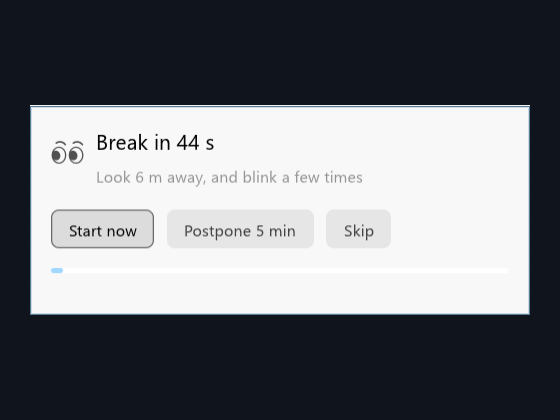
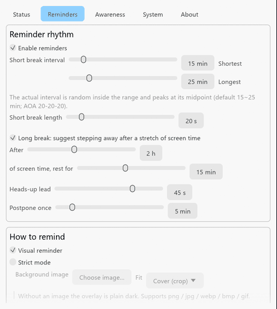
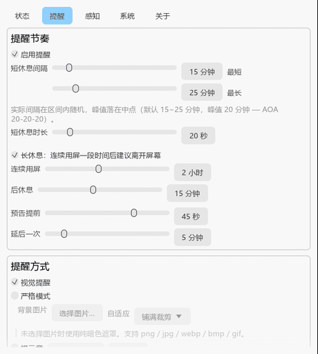

# EyeFlow

**English** ｜ [简体中文](#chinese) ｜ [Releases](https://github.com/lexingtonhibiki/EyeFlow/releases) ｜ [Changelog](CHANGELOG.md)

**A context-aware eye-care break reminder for Windows.** It knows whether you are deep in a typing flow, stuck in a full-screen game, or away from the desk — so a due reminder is **postponed to a better moment in a lighter form, and never silently dropped**.

One Rust process, no Electron, no WebView, no account, no telemetry.

[](https://github.com/lexingtonhibiki/EyeFlow/actions/workflows/ci.yml)
[](https://github.com/lexingtonhibiki/EyeFlow/releases)
[](https://github.com/lexingtonhibiki/EyeFlow/stargazers)
[](LICENSE)
[](#install)

> **If EyeFlow saves your eyes a little, a star helps more people find it** — it is the cheapest and most useful way to support a one-person project.
> **如果这个小工具帮你少熬了几次眼睛，一个 Star 就是最好的支持。**



<a id="english"></a>

## Why another eye-care reminder

Reminders are not scarce; reminders that fire *at the right moment* are. Competitor research ([docs/research/03-competitor-ux.md](docs/research/03-competitor-ux.md)) came down to one sentence: **people stay because of advance notice, controllable enforcement and a visible streak; people uninstall because of badly timed interruptions.**

| | EyeFlow | Stretchly | Workrave | LookAway |
|---|---|---|---|---|
| Platform | Windows 10/11 x64 | Win/Mac/Linux (Electron) | Win/Linux | macOS only |
| Price | Free, open source (MIT) | Free, open source | Free, open source | Paid, one-off |
| Full-screen / gaming | Degrades to a sound cue, then catches up when you exit | Needs hand-written process exclusions | None | Yes |
| Typing flow | Deferred until 8 s after typing stops | None | None | Deep-focus detection |
| Streak tracking | Yes, local file | None | Yes | Yes |
| Footprint | One Rust exe, ~10 MB | Electron-class | A few MB | Native |

EyeFlow exists to fill the one cell that was empty: **Windows + free + smart silence in full-screen or flow + a lightweight native process.**

## Demos

### Settings — five tabs

Every reminder option lives in one window, grouped into tabs instead of one long scroll: **Status** (what is happening right now), **Reminders**, **Awareness**, **System** and **About**.



### One reminder, end to end

A heads-up window (bottom right, never steals focus), then the break panel with a countdown and one eye-care tip, then it is counted into your streak.


## Features

- **Context aware**: desktop / typing flow / gaming / away are detected automatically; a reminder only appears at a sensible moment and in a sensible form.
- **Deferred, never dropped**: in flow it is delivered in full 8 s after typing pauses; in a game only a cue plays and the heads-up is sent when you exit ([ADR-0002](docs/adr/0002-reminders-are-deferred-never-dropped.md)).
- **Two-tier breaks**: short breaks (15–25 min, triangular, peaking at 20 min) plus a long break (15 min after 2 h of continuous screen time) ([ADR-0001](docs/adr/0001-aoa-20-20-20-two-tier-breaks.md)).
- **Complete chain**: heads-up window → break panel (countdown + one authoritative tip) → counted into your streak.
- **Always in control**: postpone 5 min (once per reminder, long breaks included), skip, start now, pause for one hour, do-not-disturb window. Today's postpone count is grey / orange / red at 0 / 1–2 / 3+.
- **Sound where it matters**: a cue when the heads-up appears (v0.7.0, switchable), a cue when you click *Start now*, a cue when the break completes, and a stretched cue when sound is the only channel in full-screen. 5 synthesized presets or your own audio file, 50–200 % volume.
- **Strict mode** (optional, off by default): the break panel becomes a full-screen overlay with your own background image, three fit modes and a live crop preview.
- **Bilingual UI**: English and Simplified Chinese, switchable at runtime; the tray menu, fonts and every open window follow immediately.
- **Streak tracking**: completed short / long / natural breaks, skips, postpones, consecutive days.
- **Tray + hotkey**: left click or double click opens settings; `Ctrl+Shift+E` rests now; the tooltip shows the current state and the next break time.
- **Lightweight**: one Rust process, no Electron, no WebView. Around 9.8 MB on disk, and a measured **3.13 MB private / 15.60 MB working set** while idle with no window ever opened (v0.7.0). A UI session with a GL context exists only while a panel or the settings window is on screen — that is why the settings window is not kept alive in the background ([ADR-0006](docs/adr/0006-eframe-on-demand-ui-session.md)).
- **Update check** (optional, off by default): reads the GitHub Releases API at most once every 24 h, only compares version numbers and offers a download link — it never downloads or installs anything by itself.
- **Privacy friendly**: fully local. Two files (`config.toml`, `stats.toml`) under `%APPDATA%\eyeflow\`.
- **Single instance**: a second launch simply exits.

## How it decides when to remind you

| Context | How it is detected | What happens when a reminder is due |
|---|---|---|
| Desktop | Default state (not full screen, low keyboard activity) | Delivered in full: heads-up → break panel |
| Flow | Keystrokes in a 30-second sliding window reach the threshold (low 40 / medium 70 / high 100; auto-repeat filtered) | **Deferred**: delivered in full 8 s after typing pauses |
| Gaming / do-not-disturb | `SHQueryUserNotificationState` (exclusive full screen, presentation, lock screen) plus a foreground full-screen window check | **Cue only, immediately**; the heads-up follows after you exit |
| Away | No mouse or keyboard input for 3 min | The timer **pauses**; entering the away state counts as one natural break, and ≥ 15 min away resets the long-break screen-time accumulator |

The rule underneath: **context may change when and how a reminder is delivered, but never cancels it.** Deferral is the system pushing back by itself; postpone is you pushing it back.

## Install

Requirements: Windows 10 / 11, x64. Everything is on the [Releases](https://github.com/lexingtonhibiki/EyeFlow/releases) page.

### Installer

1. Download `EyeFlow-<version>-Setup.exe` and run it. The options page can create a desktop shortcut and **asks for the interface language — Simplified Chinese by default, English optional**.
2. Autostart is enabled by default (turn it off in Settings → System). The settings window does **not** open by itself on first launch — the language was already chosen during install, so the tray icon is the only entry point (right-click → *Open settings…*).
3. Uninstall from Windows *Settings → Apps*, or *Uninstall EyeFlow* in the Start menu. Nothing is left behind: program, config, stats, log, shortcut and registry entries are all removed.

> **About SmartScreen**: the installer and the exe are not code-signed, so Windows may show "Windows protected your PC" on first run. Click **More info → Run anyway**.

### Portable

Download `eyeflow-<version>-x86_64-portable.zip`, unzip and run. No registry writes, and autostart stays off by default.

### winget (planned)

A manifest for winget-pkgs is planned, after which `winget install eyeflow` will work (see [Roadmap](#roadmap)).

## Usage

### Tray

- **Left click / double click** the icon: open settings.
- **Right-click menu**: Open settings · Enable reminders · Rest now · Pause for one hour · Sound cue · Quit.
- **Hover tooltip**: the current context and the next break time.

Pause (the whole reminder feature stops for a while) and mute (only the cue is silenced) are two different things.

### Global hotkey

- `Ctrl+Shift+E`: rest now. The combination is an OS-level **globally exclusive** resource and may clash with other software; you can turn it off in Settings → System at any time — the tray menu keeps *Rest now* either way.

### The full chain of one reminder

1. **Heads-up window** (bottom right, on top but never focused): *Break in N s*, with **Start now** / **Postpone 5 min** / **Skip**.
2. **Break panel** (centered, on top, never focused): a large countdown plus one eye-care tip from AOA/AAO sources. **[Back to work]** counts as a skip; when the countdown runs out the break is completed automatically and an end cue plays.
3. **Settlement**: the result goes into your streak (completed today, skipped, postponed, consecutive days).

Extra rules: a long break can be postponed once and stays long when it arrives; skipping a long break reminds you again after 10 minutes; in strict mode (off by default) the break panel becomes a full-screen overlay with your own background image.

## Configuration

The settings window is the recommended way, but hand-editing works just as well: `%APPDATA%\eyeflow\config.toml`. If parsing fails the original is backed up as `config.toml.bak-corrupt-<timestamp>` and rebuilt with defaults; a v0.1-era layout is migrated automatically (the values you changed are carried over, old defaults are replaced by the evidence-based ones).

```toml
enabled = true                 # master switch (same as "Enable reminders" in the tray)
short_break_min_secs = 900     # short break interval, lower bound (15 min)
short_break_max_secs = 1500    # short break interval, upper bound (25 min; triangular, peak 20 min)
short_break_secs = 30          # short break length (s)
long_break_enabled = true      # whether the long break is enabled
long_break_after_secs = 7200   # continuous screen time before a long break (2 h)
long_break_secs = 900          # long break length (15 min)
heads_up_secs = 15             # heads-up lead time (s; the long break warns 30 s ahead)
postpone_secs = 300            # postpone length (5 min; at most one postponement per reminder)
sound_enabled = true           # master switch for all cues
sound_preset = "gentle_chime"  # cue preset: gentle_chime / soft_tap / water_drop / digital_drop / triple_beep / custom
# custom_sound_path            # optional; this line is absent when unset (Option<String>, not an empty string); used when sound_preset = "custom" (wav / mp3 / ogg / flac / m4a / aac, up to 5 minutes)
cue_volume_pct = 100           # cue volume 50~200% (above 100 actively amplifies, for music/video)
cue_duration_secs = 1          # cue length 1~5 s (short patterns loop to fill it; in full-screen, sound is the only channel, so it is stretched to at least 2 s)
hotkey_enabled = true          # global hotkey Ctrl+Shift+E (rest now); it takes the combination globally and can be turned off
visual_enabled = true          # visual reminders (heads-up window + break panel); cue only when off
strict_mode = false            # strict mode: the break panel becomes a full-screen overlay
# strict_wallpaper_path        # optional; this line is absent when unset (Option<String>, not an empty string); strict-mode background image (png / jpg / webp / bmp / gif), plain dark when unset
strict_wallpaper_fit = "cover" # background fit: cover (fill and crop) / contain (fit whole) / stretch
strict_overlay_pct = 55        # strict-mode overlay opacity 0~85%
strict_overlay_gradient = false # overlay uses a top-dark, bottom-light vertical gradient
start_cue_enabled = true       # play a cue when clicking "Start now" / "Rest now"
heads_up_cue_enabled = true    # play a cue when the heads-up window appears (never plays a second cue for one round already announced by sound)
esc_skip_enabled = true        # press Esc during a break to skip (unavailable in strict mode)
update_check_enabled = false   # check for updates at startup (at most once every 24 h, GitHub Releases API only, nothing is downloaded or installed automatically)
# update_last_checked         # optional; the Unix timestamp of the last check, maintained by the program (Option<u64>)
quiet_start = "00:00"          # do-not-disturb window start
quiet_end = "08:00"            # do-not-disturb window end
flow_sensitivity = "Medium"    # flow detection sensitivity: Low / Medium / High
away_secs = 180                # no input for this long counts as away (s)
language = "zh-CN"             # interface language: zh-CN / en-US (any "en" prefix means English)
```

### Files and where they live

| Path | What it is |
|---|---|
| `%APPDATA%\eyeflow\config.toml` | every setting above |
| `%APPDATA%\eyeflow\stats.toml` | completed short / long / natural breaks, skips, postpones, streak days |
| `%APPDATA%\eyeflow\eyeflow.log` | diagnostic log, overwritten on each start |

Nothing else is written anywhere, and uninstalling removes all three.

## The science behind the defaults

The defaults are not guesses; they come from institutional guidance and peer-reviewed research (full review in [docs/research/02-science-evidence.md](docs/research/02-science-evidence.md)).

- **20-20-20**: every 20 minutes, look 6 m (20 ft) away for 20 seconds — the American Optometric Association's [computer vision syndrome guidance](https://www.aoa.org/healthy-eyes/eye-and-vision-conditions/computer-vision-syndrome). It is also the only cadence backed by both institutional guidance and a directly tested randomized controlled trial ([Talens-Estarelles et al. 2023](https://pubmed.ncbi.nlm.nih.gov/35963776/)).
- **2 hours / 15 minutes**: the same guidance asks for a 15-minute eye break after 2 hours of continuous screen time. That is where the long break comes from.
- **30-second short break rather than 20**: spontaneous micro-breaks average 27.4 s ([Henning et al. 1989](https://pubmed.ncbi.nlm.nih.gov/2806221/)). The tips remind you both to look 6 m away and to blink — blinking drops from about 15 times a minute to 5–7 while staring at a screen ([AAO](https://www.aao.org/eye-health/tips-prevention/computer-usage)).
- **No blue-light filter**: a [Cochrane 2023](https://www.cochranelibrary.com/cdsr/doi/10.1002/14651858.CD013244.pub2/full) review of 17 RCTs found no short-term benefit for eye strain, the AAO is explicit that there is no evidence screen blue light damages the eyes, and it overlaps with Windows' own night mode. So we deliberately do not do it ([ADR-0003](docs/adr/0003-gentle-by-default-no-bluelight-no-lockdown.md)).
- **No "prevents myopia / protects your eyes" claims**: digital eye strain is temporary, reversible discomfort, and the copy stays away from medical promises.

## Privacy

EyeFlow **makes no network requests by default**: no telemetry, no accounts, no automatic downloads. All data is two local files under `%APPDATA%\eyeflow\`.

Keyboard monitoring only records key **timestamps** inside this process, for flow detection — never key contents, never written to disk, never uploaded.

The only optional network feature is the **update check** (About → *Check for updates at startup*, off by default): when enabled it queries `api.github.com/repos/lexingtonhibiki/EyeFlow/releases/latest` at most once every 24 hours, compares version numbers and shows the result in the About tab. **Nothing is downloaded or installed automatically** — if a newer version exists you get a link to the Releases page and decide for yourself.

## Building from source

Requirements:

- **Rust ≥ 1.95** via [rustup](https://rustup.rs/) — either the MSVC or the GNU toolchain works:
  - MSVC: needs Visual Studio Build Tools (`rc.exe` embeds the icon and version resources);
  - GNU: needs MinGW `windres`;
- **NSIS 3** (optional): only needed to build the installer.

```bat
git clone https://github.com/lexingtonhibiki/EyeFlow.git
cd eyeflow
cargo build --release
:: artifact: target\release\eyeflow.exe (about 10 MB, update check included)

:: smallest possible build: drop the update check's TLS stack (about -1.1 MB)
cargo build --release --no-default-features

:: one-shot build + package (writes dist\EyeFlow-<version>-Setup.exe when NSIS is found)
build-release.cmd

:: demo / acceptance mode: opens the settings window on launch, fires a reminder after 60 s (heads-up 45 s), touches no config file
set EYEFLOW_DEMO=1 && target\release\eyeflow.exe
```

`cargo test` covers the scheduling core (deferral, catch-up, postpone, long break, away, do-not-disturb), config migration, statistics, audio synthesis, the i18n data layer, glyph coverage and — unusual for a desktop app — the **layout width gates**: the test suite renders the real settings window with the real fonts and asserts that no row overflows. CI runs `cargo test --locked` and `cargo build --release --locked`; pushing a `v*.*.*` tag builds the installer, the portable zip and SHA256 checksums and publishes them to Releases.

## Uninstall and data cleanup

The **installer** uninstaller (Windows *Settings → Apps*, or the Start menu) removes the program directory `%LOCALAPPDATA%\EyeFlow\`, the Start menu shortcut, the autostart entry, the *Add or Remove Programs* entry (all under HKCU, no administrator needed) and the user data `%APPDATA%\eyeflow\`.

**Portable**: end the process and delete the exe; `%APPDATA%\eyeflow\` can be deleted too. Autostart can be turned off in the settings or in Task Manager → Startup.

## Roadmap

- [x] Bilingual UI (English / Simplified Chinese, switchable at runtime)
- [x] Cue when the heads-up window appears, with its own switch
- [x] Settings window grouped into tabs, plus an About page
- [ ] Multi-monitor: the break panel and the strict-mode overlay should cover every screen
- [ ] A complete power / lock event bridge (sleeping for more than 10 minutes is already treated as being away)
- [ ] Custom global hotkeys
- [ ] Toast / system notifications as an auxiliary reminder channel
- [ ] winget package (`winget install eyeflow`)
- [ ] Redraw the panels in native Win32 (GDI / Direct2D) to get rid of the GL context and the graphics driver's memory residue
- [ ] Subset the Chinese font at build time instead of loading an 18.8 MB system font

## For developers

This README carries what a user needs. **Everything about *why* the project is built this way lives in [docs/](docs/):** numbered decision records in [docs/adr/](docs/adr/), the evidence review in [docs/research/](docs/research/), the specification in [docs/spec.md](docs/spec.md) and the domain glossary in [CONTEXT.md](CONTEXT.md).

- **Branch model and release process**: [CONTRIBUTING.md](CONTRIBUTING.md)
- **Change history**: [CHANGELOG.md](CHANGELOG.md)
- **Translations**: [locales/zh-CN.toml](locales/zh-CN.toml) and [locales/en-US.toml](locales/en-US.toml) are plain flat TOML. `build.rs` treats the Chinese file as the single source of truth and **fails the build if any key is missing or extra** in the other language — a missing translation can never reach a user as a raw key.
- **Tests as guardrails**: alongside the unit tests there are gates for locale parity, glyph coverage of both font chains, tray menu IDs, README/spec drift and the width of every settings row.

## Credits

EyeFlow is designed and written by **[lexingtonhibiki](https://github.com/lexingtonhibiki)**, and released under the MIT license. It is built on the shoulders of the Rust ecosystem — [egui](https://github.com/emilk/egui) / [eframe](https://github.com/emilk/egui/tree/master/crates/eframe) for the UI, [tray-icon](https://github.com/tauri-apps/tray-icon), [global-hotkey](https://github.com/tauri-apps/global-hotkey) and [rodio](https://github.com/RustAudio/rodio).

The default rhythm follows the [American Optometric Association](https://www.aoa.org/healthy-eyes/eye-and-vision-conditions/computer-vision-syndrome) and the research linked above, not our own opinion.

**If EyeFlow is useful to you, please give it a star** — and if you find a bug or want a feature, [open an issue](https://github.com/lexingtonhibiki/EyeFlow/issues). Both help more than you would think.

## License

[MIT](LICENSE) © 2026 lexingtonhibiki

[↑ Back to top](#eyeflow) ｜ [切换到中文 →](#chinese)

---

<a id="chinese"></a>

# EyeFlow 中文文档

[English](#english) ｜ **简体中文** ｜ [Releases](https://github.com/lexingtonhibiki/EyeFlow/releases) ｜ [更新日志](CHANGELOG.md)

**会看情况的 Windows 护眼提醒。** 它知道你正打字进入心流、在全屏游戏、还是已经离开座位——到点的提醒只会**顺延**到更合适的时机、换一种更轻的形态，而**不会悄悄消失**。

Rust 单进程，没有 Electron、没有 WebView、没有账号、没有遥测。

[](https://github.com/lexingtonhibiki/EyeFlow/actions/workflows/ci.yml)
[](https://github.com/lexingtonhibiki/EyeFlow/releases)
[](https://github.com/lexingtonhibiki/EyeFlow/stargazers)
[](LICENSE)
[](#下载安装)

> **如果这个小工具帮你少熬了几次眼睛，一个 Star 就是最好的支持** —— 它也是让更多人找到 EyeFlow 最有效的方式。
> **If EyeFlow saves your eyes a little, a star helps more people find it.**


## 为什么还要做一个护眼提醒

市面上不缺护眼提醒，缺的是「时机选得对」的那一个。竞品调研（[docs/research/03-competitor-ux.md](docs/research/03-competitor-ux.md)）的结论是一句话：**用户留下来靠预告、可控的强制和看得见的坚持记录；用户卸载，靠的是时机不对的打断。**

| | EyeFlow | Stretchly | Workrave | LookAway |
|---|---|---|---|---|
| 平台 | Windows 10/11 x64 | Win/Mac/Linux（Electron） | Win/Linux | 仅 macOS |
| 价格 | 免费开源（MIT） | 免费开源 | 免费开源 | 买断收费 |
| 全屏 / 游戏 | 降级为一声提示音，退出后补发预告 | 需手写进程排除 | 无 | 有 |
| 打字心流 | 顺延到停歇 8 秒后投递 | 无 | 无 | 有深度专注检测 |
| 坚持统计 | 有，本地文件 | 无 | 有 | 有 |
| 体积 | 单个 Rust exe，约 10 MB | Electron 级 | 数 MB | 原生 |

EyeFlow 要填的正是免费市场里空着的那一格：**Windows + 免费 + 全屏/心流智能静默 + 原生轻量进程。**

## 演示

### 设置窗：五个页签

所有提醒设置都在一个窗口里，按页签分组而不是一条长滚动流：**状态**（此刻正在发生什么）、**提醒**、**感知**、**系统**、**关于**。



### 一次提醒的完整链路

右下角的预告浮窗（不抢焦点）→ 带倒计时和一条护眼贴士的休息界面 → 计入坚持统计。


严格模式可以把休息界面变成你自己的全屏壁纸：


## 功能特性

- **上下文感知**：桌面 / 心流 / 游戏 / 离开四态自动切换，提醒只在合适的时机、以合适的形态出现。
- **只顺延、不消失**：心流中顺延到输入停歇 8 秒后完整投递；游戏中只响提示音，退出全屏后补发预告（[ADR-0002](docs/adr/0002-reminders-are-deferred-never-dropped.md)）。
- **双层休息**：短休息（15~25 分钟三角随机、峰值 20 分钟）+ 长休息（连续用屏 2 小时 → 15 分钟）（[ADR-0001](docs/adr/0001-aoa-20-20-20-two-tier-breaks.md)）。
- **完整提醒链路**：预告浮窗 → 休息界面（倒计时 + 一条权威护眼贴士）→ 自动计入坚持统计。
- **用户始终可控**：延后 5 分钟（每次提醒限 1 次，长休息同样可延后）、跳过、立即开始、暂停 1 小时、免打扰时段；今日延后次数按 0 / 1~2 / ≥3 次灰 / 橙 / 红着色。
- **该响的时候才响**：预告浮窗弹出时一声（v0.7.0 新增，可关）、点「现在开始」时一声、休息完成时一声；全屏 / 游戏里声音是唯一通道，会自动拉长到至少 2 秒。5 种合成预设或自选音频，音量 50%~200%。
- **严格模式**（可选，默认关）：休息界面变为全屏遮罩，可自选背景图片、三种自适应方式 + 实时裁剪预览。
- **中英双语**：界面随时切换，托盘菜单、字体、已打开的窗口立即跟着换。
- **坚持统计**：今日完成（短 / 长 / 自然）、跳过、延后次数、连续坚持天数。
- **托盘 + 热键**：左键单击 / 双击打开设置；`Ctrl+Shift+E` 立即休息；悬停 tooltip 显示当前状态与下次休息时间。
- **轻量**：Rust 单进程，无 Electron / WebView；磁盘上约 9.8 MB，从未打开过窗口时实测**私有内存 3.13 MB / 工作集 15.60 MB**（v0.7.0）。只有在显示浮窗 / 设置窗时才有一次带 GL 上下文的 UI 会话——这也是设置窗不常驻后台的原因（[ADR-0006](docs/adr/0006-eframe-on-demand-ui-session.md)）。
- **更新检查**（可选，默认关）：每 24 小时至多访问一次 GitHub Releases API，只比对版本号并给出下载链接——**不自动下载、不自动安装**。
- **隐私友好**：纯本地运行，全部数据就是 `%APPDATA%\eyeflow\` 下的两个文件。
- **单实例**：重复启动直接退出。

## 什么时候提醒、怎么提醒

| 上下文 | 如何判定 | 到点行为 |
|---|---|---|
| 桌面 | 默认状态（非全屏、键盘活动低） | 完整投递：预告 → 休息界面 |
| 心流 | 30 秒滑窗按键数达阈值（低 40 / 中 70 / 高 100，已过滤自动重复） | **顺延**：等输入停歇 8 秒后完整投递 |
| 游戏 / 不可打扰 | `SHQueryUserNotificationState`（独占全屏 / 演示 / 锁屏）+ 前台全屏窗口比对兜底 | **立即仅响提示音**；退出全屏后补发预告 |
| 离开 | 无鼠标键盘输入 ≥ 3 分钟 | 计时**暂停**；进入离开状态即视为一次自然休息，离开 ≥ 15 分钟清零长休息的用屏累计 |

底层原则：**上下文只能改变提醒的投递时机与形态，不能取消提醒**（顺延是系统自动推后，延后是你主动推迟）。

## 下载安装

系统要求：Windows 10 / 11，x64。全部产物都在 [Releases](https://github.com/lexingtonhibiki/EyeFlow/releases) 页面。

### 安装版

1. 下载 `EyeFlow-<版本>-Setup.exe` 并运行；安装选项页可勾选是否创建桌面快捷方式，并**选择界面语言（默认中文简体，可选 English）**。
2. 安装默认写入开机自启（可在 设置 → 系统 里关闭）。首次运行**不会**自动打开设置窗——语言已经在安装器里问过，托盘图标是唯一入口（右键托盘图标 →「打开设置…」）。
3. 卸载：系统「设置 → 应用」或开始菜单的 Uninstall EyeFlow。无残留：程序、配置、统计、日志、快捷方式、注册表项全部清理。

> **关于 SmartScreen**：安装包与 exe 目前未做代码签名，首次运行时 Windows 可能提示「Windows 已保护你的电脑」。请点击 **更多信息 → 仍要运行**。

### 便携版

下载 `eyeflow-<版本>-x86_64-portable.zip`，解压即用；不写注册表，也默认不写开机自启。

### winget（计划中）

计划向 winget-pkgs 提交清单，届时可以直接 `winget install eyeflow`（见 [Roadmap](#roadmap)）。

## 使用说明

### 托盘

- **左键单击 / 双击**图标：打开设置。
- **右键菜单**：打开设置 · 启用提醒 · 立即休息 · 暂停 1 小时 · 提示音 · 退出。
- **悬停 tooltip**：当前上下文状态与下次休息时间。

注意：**暂停**（整个提醒功能停止一段时间）与**静音**（只关闭提示音）是两件事。

### 全局热键

- `Ctrl+Shift+E`：立即休息。组合键是操作系统级**全局独占**资源，可能与其他软件冲突，可在 设置 → 系统 里随时关闭；关闭后托盘菜单的「立即休息」不受影响。

### 一次提醒的完整链路

1. **预告浮窗**（屏幕右下角，置顶但不抢焦点）：「N 秒后休息一下」，可选 **现在开始** / **延后 5 分钟** / **跳过**。
2. **休息界面**（居中，置顶不抢焦点）：大倒计时 + 一条来自 AOA/AAO 的护眼贴士。点击 **[继续工作]** 记为跳过；倒计时走完自动完成并播结束音。
3. **结算**：本次结果计入坚持统计（今日完成 / 跳过 / 延后 / 连续坚持天数）。

补充规则：长休息可延后一次，到点后仍是长休息；跳过长休息后 10 分钟会再次提示；严格模式（默认关）下休息界面变为全屏遮罩，可在设置里选一张背景图片并预览裁剪效果。

## 配置文件

推荐通过设置界面修改，手工编辑同样有效：`%APPDATA%\eyeflow\config.toml`。解析失败时原文件会备份为 `config.toml.bak-corrupt-<时间戳>` 后以默认值重建；检测到 v0.1 旧格式时会自动迁移——你改过的值带过来，旧默认值换成新的循证默认值。

```toml
enabled = true                 # 提醒总开关（与托盘"启用提醒"一致）
short_break_min_secs = 900     # 短休息间隔下限（15 分钟）
short_break_max_secs = 1500    # 短休息间隔上限（25 分钟；三角分布，峰值 20 分钟）
short_break_secs = 30          # 短休息时长（秒）
long_break_enabled = true      # 是否启用长休息
long_break_after_secs = 7200   # 连续用屏多久触发长休息（2 小时）
long_break_secs = 900          # 长休息时长（15 分钟）
heads_up_secs = 15             # 预告提前量（秒；长休息预告为 30 秒）
postpone_secs = 300            # 延后时长（5 分钟；每次提醒最多延后 1 次）
sound_enabled = true           # 提示音总开关
sound_preset = "gentle_chime"  # 提示音预设：gentle_chime / soft_tap / water_drop / digital_drop / triple_beep / custom
# custom_sound_path            # 可选，未设置时本行不出现（Option<String>，不是空串）；sound_preset = "custom" 时使用（wav / mp3 / ogg / flac / m4a / aac，≤ 5 分钟）
cue_volume_pct = 100           # 提示音音量 50~200%（>100 为主动放大，适配音乐/视频场景）
cue_duration_secs = 1          # 提示音时长 1~5 秒（短图案循环铺满；全屏时声音是唯一通道，自动至少 2 秒）
hotkey_enabled = true          # 全局热键 Ctrl+Shift+E（立即休息）；会全局独占组合键，可关闭
visual_enabled = true          # 视觉提醒（预告浮窗 + 休息界面）；关闭后仅声音
strict_mode = false            # 严格模式：休息界面变为全屏遮罩
# strict_wallpaper_path        # 可选，未选择图片时本行不出现（Option<String>，不是空串）；严格模式背景图片（png / jpg / webp / bmp / gif），未选时为纯暗色
strict_wallpaper_fit = "cover" # 背景自适应：cover（铺满裁剪）/ contain（完整显示）/ stretch（拉伸）
strict_overlay_pct = 55        # 严格模式蒙层浓度 0~85%
strict_overlay_gradient = false # 蒙层用上深下浅的垂直渐变
start_cue_enabled = true       # 点击"现在开始/立即休息"时播放提示音
heads_up_cue_enabled = true    # 预告浮窗弹出时播放提示音（同一回合已用声音播报过时不会响第二声）
esc_skip_enabled = true        # 休息中按 Esc 跳过（严格模式下不可用）
update_check_enabled = false   # 启动时检查更新（每 24 小时至多一次，仅访问 GitHub Releases API，不自动下载、不自动安装）
# update_last_checked         # 可选；上次检查更新的 Unix 时间戳，由程序维护（Option<u64>）
quiet_start = "00:00"          # 免打扰时段开始
quiet_end = "08:00"            # 免打扰时段结束
flow_sensitivity = "Medium"    # 心流判定灵敏度：Low / Medium / High
away_secs = 180                # 无输入多久判定为离开（秒）
language = "zh-CN"             # 界面语言：zh-CN / en-US（凡以 "en" 开头一律视为英文）
```

### 文件与位置

| 路径 | 内容 |
|---|---|
| `%APPDATA%\eyeflow\config.toml` | 上面全部设置 |
| `%APPDATA%\eyeflow\stats.toml` | 今日完成（短 / 长 / 自然）、跳过、延后、连续坚持天数 |
| `%APPDATA%\eyeflow\eyeflow.log` | 诊断日志，每次启动覆盖 |

除这三个文件之外不写任何位置；卸载会把它们一并清理。

## 默认参数的科学依据

默认参数不是拍脑袋，取自机构指南与同行评审研究（完整调研见 [docs/research/02-science-evidence.md](docs/research/02-science-evidence.md)）。

- **20-20-20**：每 20 分钟看 6 米（20 英尺）外 20 秒——出自美国验光协会（AOA）的[计算机视综合征指南](https://www.aoa.org/healthy-eyes/eye-and-vision-conditions/computer-vision-syndrome)。它也是唯一同时有机构指南背书与随机对照试验直接检验的节奏（[Talens-Estarelles et al. 2023](https://pubmed.ncbi.nlm.nih.gov/35963776/)）。
- **2 小时 / 15 分钟**：同一指南要求连续用屏 2 小时后休息眼睛 15 分钟——EyeFlow 的长休息由此而来。
- **短休息默认 30 秒而非 20 秒**：自发微休息的平均时长是 27.4 秒（[Henning et al. 1989](https://pubmed.ncbi.nlm.nih.gov/2806221/)）。休息贴士会同时提醒「看 6 米外」与「多眨几次眼」——盯着屏幕时眨眼会从每分钟约 15 次降到 5~7 次（[AAO](https://www.aao.org/eye-health/tips-prevention/computer-usage)）。
- **不做蓝光滤镜**：[Cochrane 2023](https://www.cochranelibrary.com/cdsr/doi/10.1002/14651858.CD013244.pub2/full) 对 17 项 RCT 的综述显示蓝光过滤对视疲劳可能没有短期获益，AAO 也明确「无证据表明屏幕蓝光损伤眼睛」，且与 Windows 自带「夜间模式」重叠。因此明确不做（[ADR-0003](docs/adr/0003-gentle-by-default-no-bluelight-no-lockdown.md)）。
- **不做「防近视 / 防眼损伤」承诺**：数字视疲劳是暂时性、可逆的不适，贴士与文案刻意避开此类表述。

## 隐私

EyeFlow **默认不发起任何网络请求**：无遥测、无账号、无自动下载。全部数据就是 `%APPDATA%\eyeflow\` 下的两个本地文件。

键盘监测仅在本进程内记录按键**时间戳**用于心流判定——不记录按键内容、不写盘、不上传。

唯一的可选联网功能是**更新检查**（关于页 →「启动时检查更新」，默认关闭）：开启后每 24 小时至多访问一次 `api.github.com/repos/lexingtonhibiki/EyeFlow/releases/latest`，只比对版本号并把结果显示在关于页。**不自动下载、不自动安装**——发现新版本时给出一个 Releases 链接，下不下、下哪个包，由你自己决定。

## 从源码构建

前置要求：

- **Rust ≥ 1.95**（经 [rustup](https://rustup.rs/) 安装；MSVC 或 GNU 工具链均可）：
  - MSVC 工具链：需要 Visual Studio Build Tools（用 `rc.exe` 嵌入图标与版本资源）；
  - GNU 工具链：需要 MinGW 的 `windres`；
- **NSIS 3**（可选）：仅在需要生成安装包时使用。

```bat
git clone https://github.com/lexingtonhibiki/EyeFlow.git
cd eyeflow
cargo build --release
:: 产物：target\release\eyeflow.exe（约 10 MB，含更新检查）

:: 极限体积构建：去掉更新检查的 TLS 栈（约 -1.1 MB）
cargo build --release --no-default-features

:: 一键构建 + 打包（检测到 NSIS 时输出 dist\EyeFlow-<版本>-Setup.exe）
build-release.cmd

:: 演示 / 验收模式：启动即打开设置窗，60 秒后触发一次提醒（预告 45 秒），不改动配置文件
set EYEFLOW_DEMO=1 && target\release\eyeflow.exe
```

`cargo test` 覆盖调度核心（顺延 / 补发 / 延后 / 长休息 / 离开 / 免打扰）、配置迁移、统计、音频合成、i18n 数据层、字形覆盖，外加一套桌面应用里少见的**宽度闸门**：测试会真的用产品字体渲染设置窗的每一行，断言没有任何一行溢出。CI 跑 `cargo test --locked` 与 `cargo build --release --locked`；推送 `v*.*.*` 标签时自动构建安装包、便携 zip 与 SHA256 并发布到 Releases。

## 卸载与数据清理

**安装版**卸载程序（系统「设置 → 应用」或开始菜单）会清理程序目录 `%LOCALAPPDATA%\EyeFlow\`、开始菜单快捷方式、开机自启项、「添加或删除程序」注册表项（均在 HKCU，无需管理员）以及用户数据 `%APPDATA%\eyeflow\`。

**便携版**：结束进程后删除 exe 即可，`%APPDATA%\eyeflow\` 可以一并删除。开机自启也可在设置界面或任务管理器「启动应用」中随时关闭。

## Roadmap

- [x] 中英双语界面（运行时可切）
- [x] 预告浮窗提示音，带独立开关
- [x] 设置窗页签分组 + 「关于」页
- [ ] 多显示器：休息界面 / 严格模式遮罩覆盖所有屏幕
- [ ] 完整的电源 / 锁屏事件桥（睡眠超 10 分钟已自动按离席处理）
- [ ] 自定义全局热键
- [ ] Toast / 系统通知作为辅助提醒通道
- [ ] winget 包（`winget install eyeflow`）
- [ ] 浮窗改为 Win32 自绘（GDI / Direct2D），彻底摆脱 GL 上下文与显卡驱动的内存残留
- [ ] 构建期做中文字体子集化，不再加载 18.8 MB 的系统字体

## 给开发者

这份 README 只讲用户需要知道的事。**「为什么这样设计」全部记在 [docs/](docs/) 里**：编号决策记录在 [docs/adr/](docs/adr/)，证据调研在 [docs/research/](docs/research/)，规格见 [docs/spec.md](docs/spec.md)，领域词汇表见 [CONTEXT.md](CONTEXT.md)。

- **分支模型与发布流程**：[CONTRIBUTING.md](CONTRIBUTING.md)
- **变更历史**：[CHANGELOG.md](CHANGELOG.md)
- **翻译**：[locales/zh-CN.toml](locales/zh-CN.toml) 与 [locales/en-US.toml](locales/en-US.toml) 是扁平 TOML。`build.rs` 以中文文件为唯一事实来源，**另一种语言缺键或多键都会让构建直接失败**——漏翻永远不会以 key 的形式出现在用户界面上。
- **测试即护栏**：除单元测试外，还有语言表对齐、两条字体链的字形覆盖、托盘菜单 ID、README / spec 漂移，以及设置窗每一行的宽度闸门。

## 致谢

EyeFlow 由 **[lexingtonhibiki](https://github.com/lexingtonhibiki)** 设计与编写，以 MIT 许可证发布。它站在 Rust 生态的肩膀上——界面用 [egui](https://github.com/emilk/egui) / [eframe](https://github.com/emilk/egui/tree/master/crates/eframe)，托盘与热键用 [tray-icon](https://github.com/tauri-apps/tray-icon) 与 [global-hotkey](https://github.com/tauri-apps/global-hotkey)，音频用 [rodio](https://github.com/RustAudio/rodio)。

默认节奏依据的是[美国验光协会](https://www.aoa.org/healthy-eyes/eye-and-vision-conditions/computer-vision-syndrome)与上面那些研究，不是我们自己的想当然。

**如果 EyeFlow 对你有用，请给它一个 Star**；发现 bug 或有想要的功能，欢迎[提 issue](https://github.com/lexingtonhibiki/EyeFlow/issues)。这两件事的帮助都比你以为的大。

## License

[MIT](LICENSE) © 2026 lexingtonhibiki

[↑ 回到顶部](#eyeflow) ｜ [Switch to English →](#english)